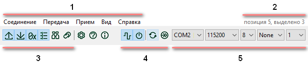
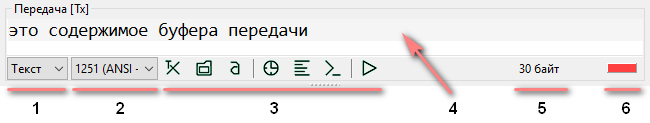
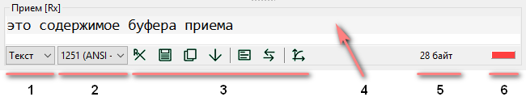
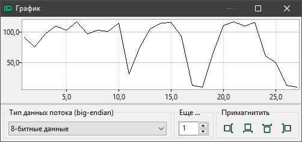
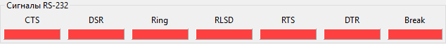
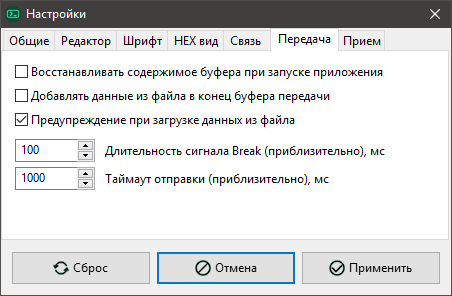

# uTerminal. Руководство пользователя

[TOC]

# Введение

uTerminal (читается `микротерминал`) — приложение-терминал для последовательного порта. Возможности:

- полная настройка параметров порта (скорость, биты данных, бит четности, стоп-биты),
- обновление списка портов и проверка доступности для подключения,
- автоматическое подключение к ранее использованному порту при запуске приложения,
- отключаемое аппаратное управление потоком (RTS/CTS),
- отключаемое отображение сигналов RS-232 с возможностью управления ими,
- отдельные буферы передачи и приема,
- отключаемое восстановление содержимого буферов при запуске приложения,
- выбор кодировки данных,
- отображение данных в разных форматах (текст, значения байтов — HEX, BIN, DEC),
- отдельные поля для отображения данных в HEX-виде,
- поиск и замена по данных,
- передача данных:
  - автоотправка по настраиваемому таймеру,
  - список сохраненных сообщений,
  - окно вставки символов (с кодами от 0 до 255),
  - загрузка данных из файла в буфер передачи,
  - настаиваемая длительность сигнала Break,
  - настаиваемый таймаут отправки,
- прием данных:
  - отключаемая прокрутка к концу при получении новых данных,
  - настраиваемые ответы на входные данные,
  - сохранение полученных данных в файл,
  - график (с настройкой формата данных),
  - отключение приемника без отключения от порта,
  - настраиваемая временная метка в начале пакета,
  - настаиваемый таймаут пакета,
  - настаиваемый размер буфера,
- продвинутые настройки интерфейса:
  - выбор языка интерфейса,
  - размещение полей данных,
  - отключение меню, строки статуса, индикаторов активности, счетчиков размера данных,
  - настройка шрифта полей данных, типа перехода на новую строку, ширины табуляции, видимости правой границы, отключение сглаживания,
  - отображение позиции курсора и размера выделения в полях данных (в байтах).

# Интерфейс

Интерфейс приложения разработан для максимальной компактности и максимального отображения содержимого буферов. Большинство элементов имеют всплывающую подсказку, которая отображается при наведении курсора мыши.

1. Стандартное меню, содержит большинство команд.
2. Позиция курсора в поле и размер выделения (в байтах).
3. Панель быстрого доступа `Вид`.
4. Панель быстрого доступа `Соединение`.
5. Панель настроек последовательного порта.

> *Примечание.* Позиция курсора в поле рассчитывается в байтах, фактически это смещение в байтах от начала. Размер выделения также в байтах, т.к. в некоторых кодировках один символ может иметь размер больше одного байта. Если эти опции не нужны, их можно отключить — снять флажок `Соединение > Настройки : Редактор > Показывать позицию курсора и размер выделения`. Если этот флажок установлен, а стандартное меню скрыто (не установлен флажок `Соединение > Настройки : Общие > Показывать стандартное меню`), то позиция курсора и размер выделения будут отображаться слева от размера буфера каждого из полей приема и/или передачи.

## Поле передачи

1. Представление данных (`текст`, `HEX`, `BIN`, `DEC`).
2. Кодировка данных.
3. Панель быстрого доступа `Передача`.
4. Содержимое буфера данных.
5. Количество данных в буфере.
6. Индикатор активности передатчика.

## Поле приема

1. Представление данных (`текст`, `HEX`, `BIN`, `DEC`).
2. Кодировка данных.
3. Панель быстрого доступа `Прием`.
4. Содержимое буфера данных.
5. Количество данных в буфере.
6. Индикатор активности приемника.

> *Примечание.* Высоту полей передачи и приема можно взаимно изменять мышью при помощи визуального разделителя.

## Трей

В системном трее отображается значок приложения. Щелчок левой кнопкой мыши сворачивает (или разворачивает) приложение в трей. При свернутом в трей состоянии вкладка на панели задач не отображается. При щелчке правой кнопкой мыши на значке в трее доступно меню с общими командами управления.

Также можно настроить сворачивание в трей стандартной кнопкой окна `Свернуть`: `Соединение > Настройки : Общие > Сворачивать в трей`.

# Подключение к порту

При запуске приложения происходит поиск зарегистрированных в системе портов. Список хранится в выпадающем списке (панель настроек порта). В процессе работы с терминалом обновить этот список можно командой `Соединение > Сканировать`. При сканировании также определяется доступен ли порт для подключения путем попытки подключиться к нему. Если порт занят, то в списке напротив этого порта указывается состояние `< занят >`. Проверку доступности можно отключить в настройках: вкладка `Связь`, флажок `Проверять доступность порта при сканировании`.

Чтобы начать работу с портом и иметь возможность передавать и/или принимать данные, необходимо подключиться к порту. Выберите порт, задайте скорость и другие настройки, затем подключитесь — `Соединение > Подключиться`. Если порт свободен, не используется другими приложениями и к нему удалось подключиться, в заголовке приложения будет отображаться информация о подключенном порте и его настройках.

Дополнительные настройки смотрите в `Соединение > Настройки` на вкладке `Связь`.

# Прием

По умолчанию прием начинается сразу же после подключения к порту. Можно приостановить прием (без отключения от порта), деактивировав кнопку-флаг `Соединение > Включить прием`. Команды управления приемом находятся в меню `Прием`.

Содержимое буфера принятых данных отображается текстом в выбранной кодировке (вид `Текст`) или в виде значений байтов (вид `HEX`, `BIN`, `DEC`). Изменение вида данных или кодировки не влияет на полученные данные, а только изменяет их представление.

| Выбранный вид | Отображение                                      |
| :------------ | :----------------------------------------------- |
| Текст         | `hello world`                                    |
| HEX           | `68 65 6C 6C 6F 20 77 6F 72 6C 64`               |
| BIN           | `01101000 01100101 01101100 01101100 01101111` … |
| DEC           | `104 101 108 108 111 32 119 111 114 108 100`     |

При приеме периодических данных (например, лога) бывает удобно всегда видеть последние принятые данные. Чтобы это было возможным, активируйте кнопку-флаг `Прием > Прокручивать к концу`. Если этот флаг не установлен, то при поступлении новых данных не будет происходить прокрутка к концу. Это позволяет анализировать ранее принятые данные, при этом получая новые.

Команды меню `Прием > Автоответ` позволяют настроить и включить автоматический ответ. Когда эта функция активна, при поступлении пакета данных он сравнивается с записями в таблице и если обнаружено совпадение, передатчик отправляет соответствующий ответ.

Содержимое буфера приема можно сохранить в текстовый файл (`Прием > Сохранить данные в файл ...`) или скопировать в буфер обмена (`Прием > Скопировать данные`).

Дополнительные настройки приема смотрите в `Соединение > Настройки` на вкладке `Прием`.

## График

Команда `Прием > График по входных данных` показывает окно с графиком, где по оси **X** — порядковый номер точки, по **Y** — значение. Значение определяется исходя из выбранного типа данных потока. Масштабирование графика — автоматическое вписывание в область вывода.

# Передача

Передатчик активируется сразу же после подключения к порту.

Выберите вид и кодировку данных. Введите данные в поле буфера передачи в выбранном виде. Если задан вид `Текст`, введите данные текстом в выбранной кодировке, если один из видов `HEX`, `BIN`, `DEC` — в виде значений, разделяя их не менее чем одним пробелом или переносом. Для ввода данных в **HEX**-виде можно использовать только символы цифр **0—9** и латинских букв **A—F**, для **DEC** — только символы цифр **0—9**, для **BIN** — только цифры **0** и **1**. Другие символы будут проигнорированы, регистр не имеет значения.

Данные также можно загрузить из произвольного файла — `Передача > Загрузить данные из файла ...`

Также можно вставить любой из символов в выбранной кодировке — кнопка `Вставка произвольного символа` .

Чтобы передать данные буфера передачи, воспользуйтесь командой `Передача > Отправить`.

Если установить флаг `Передача > Автомат`, то буфер передачи будет автоматически передаваться через заданные интервалы времени.

Если после передачи данных необходимо каждый раз очищать буфер, то можно включить эту возможность командой-флагом `Передача > Командный режим`.

Дополнительные настройки передачи смотрите в `Соединение > Настройки` на вкладке `Передача`.

## Список сохраненных сообщений

Для более удобной отправки повторяющихся данных можно воспользоваться списком сохраненных сообщений, активировав флаг `Показать список` в меню `Передача > Список сохраненных`.

| Команда меню `Передача > Список сохраненных` | Действие                                                     |
| -------------------------------------------- | ------------------------------------------------------------ |
| `Добавить`                                   | Добавляет в конец списка сообщение с содержимым буфера передачи |
| `Удалить`                                    | Удаляет из списка выбранное сообщение                        |
| `Обновить`                                   | Обновляет выбранное сообщение, заменяя его содержимым буфера передачи |
| `Получить`                                   | Обновляет буфер передачи, заменяя его содержимым выбранного сообщения |
| `Переместить вверх`                          | Перемещает выбранное сообщение на одну позицию вверх в списке |
| `Переместить вниз`                           | Перемещает выбранное сообщение на одну позицию вниз в списке |
| `Отправить`                                  | Передает содержимое выбранного сообщения (можно также передать двойным щелчком левой кнопки мыши по выделенному сообщению) |

# Панель сигналов RS-232

Чтобы показать панель стандартных сигналов **RS-232**, активируйте кнопку-флаг `Соединение > Панель сигналов`.

Состояние сигналов отображается индикаторами: красный — **0**, зеленый — **1**.

Сигналы `Break`, `RTS`, `DTR` доступны для управления вручную: переключить состояние можно кнопкой-подписью над индикатором.

Если включена опция `Соединение > Настройки : Связь > Включить аппаратное управление потоком (RTS/CTS)`, то нет возможности ручного управления состоянием сигналов `RTS` и `DTR`.

# Поиск

Приложение имеет возможность искать данные в буферах передачи или приема. Также можно заменять искомые данные в буфере передачи. Панель поиска можно открыть активировав кнопку-флаг `Вид > Поиск`.

Если требуется только найти данные, введите в поле поиска (с подсказкой `что искать`) искомую строку и снимите флажки `Заменить` и `все`. Кнопки `Найти предыдущее совпадение` и `Найти следующее совпадение` работают относительно текущего положения курсора. После нахождения совпадения курсор устанавливается на начало или конец (в зависимости от направления поиска) найденного фрагмента, который подсвечивается выделением. Если необходимо учитывать регистр искомого текста, установите флажок `с учетом регистра`.

Чтобы заменить некоторые данные на другие, включите режим замены, установив флажок `Заменить`. Замена работает так же, как и поиск, но найденный фрагмент заменяется на содержимое поля замены (с подсказкой `на что заменить`). Чтобы заменить все совпадения разом, установите флажок `все`. Учтите, множественная замена работает *от курсора* в выбранном направлении!

# Настройки

Для комфорта пользователя есть различные настройки внешнего вида и поведения приложения.

Команда-флаг `Вид > Поверх всех окон` управляет видимостью окна приложения — если флаг установлен, то приложение всегда будет отображаться поверх других окон, даже если оно теряет фокус.

Остальные настройки находятся в окне, которое можно вызвать командой `Соединение > Настройки`. Большинство настроек имеет понятное назначение, некоторые имеют дополнительную подсказку при наведении на них курсора мыши.

# Полезная информация

Ссылки на онлайн-ресурсы по теме:

| Тема                                             | wiki                                                         | wikiwand                                                     | Другие                                                       |
| ------------------------------------------------ | ------------------------------------------------------------ | ------------------------------------------------------------ | ------------------------------------------------------------ |
| Универсальный асинхронный приёмопередатчик, UART | [>>>](https://ru.wikipedia.org/wiki/Универсальный_асинхронный_приёмопередатчик) | [>>>](https://www.wikiwand.com/ru/Универсальный_асинхронный_приёмопередатчик) | [3d-diy.ru](https://3d-diy.ru/wiki/arduino-moduli/interfeys-peredachi-dannykh-uart/), [cxem.net](https://cxem.net/mc/mc129.php) |
| Последовательный порт                            | [>>>](https://ru.wikipedia.org/wiki/Последовательный_порт)   | [>>>](https://www.wikiwand.com/ru/Последовательный_порт)     |                                                              |
| RS-232                                           | [>>>](https://ru.wikipedia.org/wiki/RS-232)                  | [>>>](https://www.wikiwand.com/ru/RS-232)                    | [softelectro.ru](http://www.softelectro.ru/rs232.html), [gaw.ru](http://www.gaw.ru/html.cgi/txt/interface/rs232) |
| Нуль-модемное соединение                         | [>>>](https://ru.wikipedia.org/wiki/Нуль-модемное_соединение) | [>>>](https://www.wikiwand.com/ru/Нуль-модемное_соединение)  |                                                              |

## Полезные программы

[Null-modem emulator  (com0com)](http://com0com.sourceforge.net)

[Эмуляторы COM-портов и Null-модемного кабеля](http://microsin.net/programming/pc/com-and-null-modem-emulators.html)

# Помощь в интернационализации интерфейса

Автор будет благодарен за Вашу помощь в переводе интерфейса приложения и справочных материалов на Ваш родной язык.

Приложение разработано с возможностью легкой локализации интерфейса. Файлы локализаций размещаются в каталоге [bin/lang](../bin/lang).

Чтобы перевести интерфейс на другой язык, следуйте нижеприведенным инструкциям:

1. Скопируйте файл `*.ru.po` (каталог [bin/lang](../bin/lang)) и замените суффикс локали на свой, например, для немецкого `*.de.po`.
2. Откройте свой файл `*.??.po` в [Virtaal](http://translate.sourceforge.net/wiki/virtaal/index).
3. Осуществите перевод с русского на свой родной язык и сохраните переведенный файл.
4. Добавьте в `languages.ini` определение для своего перевода:
   - увеличьте значение `Count` на единицу (`Count` показывает число доступных локализаций),
   - добавьте строку вида `L-<index>=<locale><description>`, например,  `L-1=RU, Russian - Русский`,
   - обратите внимание, первые 2 символа описания должны совпадать с суффиксом локали (регистр не имеет значения).

## Список доступных языков

| Язык                               | Автор           | Переведено |
| ---------------------------------- | --------------- | ---------- |
| Русский (оригинальный, встроенный) | Riva (riva-lab) | —          |
| English                            | Riva (riva-lab) | 100%       |

