uTerminal v2. Руководство пользователя
======================================


[TOC]

# Введение

**uTerminal** (читается `микротерминал`) — продвинутый терминал и плоттер для последовательного порта. 

Возможности:

- порт:
  - полная настройка параметров порта (скорость, биты данных, бит четности, стоп-биты),
  - обновление списка портов и проверка доступности для подключения,
  - автоматическое подключение к ранее использованному порту при запуске приложения,
  - аппаратное управление потоком (RTS/CTS),
  - отображение сигналов RS-232 с возможностью управления ими,
- передача и прием:
  - отдельные буферы передачи и приема,
  - восстановление содержимого буферов при запуске приложения,
  - поддержка разных кодировок данных,
  - отображение данных в разных форматах (текст или байты в HEX, BIN, DEC),
  - отдельные поля для отображения данных в HEX-виде,
  - настройка перехода на новую строку,
  - поиск и замена по данных, с поддержкой регулярных выражений,
- передача данных:
  - автоматическая отправка по настраиваемому таймеру,
  - список сохраненных сообщений,
  - окно вставки символов (с кодами от 0 до 255),
  - загрузка данных из файла в буфер передачи,
  - настройка длительности сигнала Break,
  - настройка таймаута отправки,
- прием данных:
  - прокрутка к концу при получении новых данных,
  - поддержка ответа на входные данные,
  - сохранение полученных данных в файл,
  - приостановка приема без отключения от порта,
  - добавление временной метки в начале пакета,
  - настройка таймаута пакета,
  - настройка размера буфера,
- плоттер по принятых данных:
  - поддержка формата Arduino с расширенными возможностями,
  - поддержка формата RegExp Universal — заданный пользователем на основе регулярных выражений,
  - поддержка форматов "сырых" данных,
  - поддержка управляющих команд (очистка, сброс и т. д.),
  - до 16 линий, каждой из которых можно задать свой цвет, стиль, толщину, размер точек,
  - 3 основных режима отображения: стандартный, 2D и развертка,
  - 2 режима вывода: live и накопление данных,
  - экспорт данных в CSV,
  - экспорт изображения в PNG,
  - гибкая настройка отображения линий: цвет, стиль, толщина, точки,
  - трекер точек на линиях,
- интерфейс:
  - интуитивный и дружественный дизайн,
  - полная поддержка дисплеев разной плотности,
  - поддержка локализаций,
  - поддержка тем: светлая и темная,
  - изменяемое размещение полей Tx и Rx,
  - гибкость — многие элементы можно скрыть или изменить внешний вид,
- а также:
  - подробная справка,
  - поддержка онлайн-обновления.

# Интерфейс

Интерфейс **uTerminal** лаконичен и функционален. Приоритет имеет максимальное отображение содержимого буферов. Большинство элементов имеют всплывающую подсказку, которая отображается при наведении курсора мыши. Почти все элементы окна можно скрыть.

## Элементы интерфейса

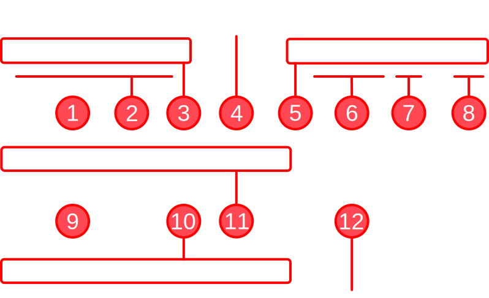

1. Содержимое буфера [передачи](#передача).
2. Заголовок поля передачи.
3. [Панель инструментов](#панель-инструментов-главная) `Главная`: основные команды.
4. Стандартное меню, содержит большинство команд.
5. [Панель инструментов](#панель-инструментов-порт) `Порт`: настройки [порта](#порт) и подключения.
6. Позиция курсора в поле и размер выделения (в байтах).
7. Количество данных в буфере (в байтах).
8. Индикатор активности передатчика.
9. Содержимое буфера [приема](#прием).
10. [Панель инструментов](#панель-инструментов-приемник) `Приемник`: команды управления приемником.
11. [Панель инструментов](#панель-инструментов-передатчик) `Передатчик`: команды управления передатчиком.
12. Статусная строка.

> **Обратите внимание**.
> 
> Позиция курсора в поле и размер выделения рассчитываются в байтах. Позиция — это фактически смещение в байтах от начала. Такое поведение обусловлено тем, что в некоторых кодировках один символ может иметь размер больше одного байта. Отображение этих элементов можно отключить, сняв флажок `Отображать позицию курсора и размер выделения` в настройках на вкладке `Редактор`.

Соотношение размеров полей передачи и приема можно взаимно изменять мышью при помощи визуального разделителя (сплиттера).

Панели инструментов можно скрывать. За это отвечают флажки в меню `Вид`. Также эти флажки есть в выпадающем меню по щелчку правой кнопкой мыши на свободном пространстве между панелями.

## Панель инструментов *Главная*

| Кнопка                            | Комбинация           | Меню       | Команда в меню               | Что делает                                                                                                               |
|:---------------------------------:|:--------------------:|:----------:|:----------------------------:| ------------------------------------------------------------------------------------------------------------------------ |
|              | `F5`                 | Вид        | Показывать буфер передачи    | Переключает видимость области интерфейса с данными буфера передачи                                                       |
|              | `F6`                 | Вид        | Показывать буфер приема      | Переключает видимость области интерфейса с данными буфера приема                                                         |
|     | `Ctrl` + `P`         | Плоттер    | Переключиться на плоттер     | Переключает режим плоттера                                                                                               |
|      | `F7`                 | Вид        | Показывать данные в HEX-виде | Если активирована, то справа от поля буфера отображается дополнительное поле, в котором продублированы данные в HEX-виде |
|     | `F8`                 | Вид        | Показывать номера строк      | Переключает видимость номеров строк слева от поля                                                                        |
|  | `Ctrl` + `F`         | Вид        | Поиск                        | Переключает видимость панели поиска                                                                                      |
|      | `F12`                | Вид        | Поверх всех окон             | Переключает отображение окна **uTerminal**: нормальное или поверх остальных окон                                         |
|            | `Ctrl` + `Alt` + `S` | Соединение | Настройки                    | Открывает окно настроек **uTerminal**                                                                                    |
|            | `F1`                 | Справка    | Справка                      | Открывает справку по **uTerminal**                                                                                       |
|            |                      | Справка    | О приложении                 | Отображает информацию о **uTerminal**: версия, сборка и т. п.                                                            |

## Панель инструментов *Порт*

| Кнопка                                  | Комбинация            | Меню       | Команда в меню         | Что делает                                                                                                  |
|:---------------------------------------:|:---------------------:|:----------:|:----------------------:| ----------------------------------------------------------------------------------------------------------- |
|          | —                     | Соединение | Доп. настройки порта   | Открывает всплывающее меню с дополнительными настройками порта, такими как биты данных, четности, стоп-биты |
|         | `Shift` + `Alt` + `S` | Соединение | Панель сигналов        | Переключает видимость панели сигналов RS-232                                                                |
|       | `Shift` + `Alt` + `E` | Соединение | Включить прием         | Переключает разрешение работы приемника                                                                     |
|  | `Ctrl` + `G`          | Соединение | Сканировать            | Обновляет список доступных портов                                                                           |
|         | `Ctrl` + `D`          | Соединение | Подключить / Отключить | Подключается к порту, если ранее был отключен. Отключается от порта, если ранее был подключен               |

## Панель инструментов *Передатчик*

| Кнопка                            | Комбинация             | Меню     | Команда в меню               | Что делает                                                                                                        |
|:---------------------------------:|:----------------------:|:--------:|:----------------------------:| ----------------------------------------------------------------------------------------------------------------- |
|     | `Shift` + `Alt` + `T`  | Передача | Очистить буфер передачи      | Удаляет все данные из буфера передачи                                                                             |
|            | `Ctrl` + `O`           | Передача | Загрузить данные из файла... | Открывает диалог выбора файла, а затем загружает содержимое выбранного файла в буфер передачи                     |
|          | `Shift` + `Ctrl` + `C` | —        | —                            | Открывает окно выбора произвольного символа ASCII и вставляет выбранный символ в текущую позицию в буфер передачи |
|     | `Ctrl` + `R`           | Передача | Автомат                      | Переключает режим автоматической отправки буфера передачи через заданные интервалы времени                        |
|  | `Ctrl` + `Alt` + `R`   | Передача | Список <...> : Показать      | Переключает видимость списка сохраненных последовательностей для передачи                                         |
|  | `Ctrl` + `T`           | Передача | Командный режим              | Переключает режим автоматической очистки буфера передачи после отправки данных                                    |
|   | `Ctrl` + `Enter`       | Передача | Отправить                    | Инициирует отправку данных из буфера передачи                                                                     |

## Панель инструментов *Приемник*

| Кнопка                                      | Комбинация            | Меню    | Команда в меню             | Что делает                                                                                 |
|:-------------------------------------------:|:---------------------:|:-------:|:--------------------------:| ------------------------------------------------------------------------------------------ |
|               | `Shift` + `Alt` + `R` | Прием   | Очистить буфер приема      | Удаляет все данные из буфера приема                                                        |
|                      | `Ctrl` + `S`          | Прием   | Сохранить данные в файл... | Открывает диалог выбора файла, а затем сохраняет содержимое буфера приема в выбранный файл |
|                      | —                     | Прием   | Скопировать данные         | Копирует содержимое буфера передачи в буфер обмена                                         |
|                | `Ctrl` + `E`          | Прием   | Прокручивать к концу       | Переключает режим прокручивания к концу при приеме данных                                  |
|  | —                     | Прием   | Таблица ответов ...        | Открывает окно **Автоответ**, где можно задать входные и ответные последовательности       |
|       | `Ctrl` + `Alt` + `A`  | Прием   | Включить автоответ         | Переключает режим автоматического ответа на принятый пакет                                 |
|               | `Ctrl` + `P`          | Плоттер | Переключиться на плоттер   | Переключает отображение с буфера приема на плоттер и обратно                               |

## Значок в трее

**uTerminal** отображает значок в системной области уведомлений — трее.

Щелчок левой кнопкой мыши по значку сворачивает окно **uTerminal** в трей (или разворачивает, если было свернуто). При свернутом в трей состоянии вкладка на панели задач не отображается.

Щелчок правой кнопкой мыши по значку в трее открывает всплывающее меню с некоторыми общими командами управления.

Если в настройках на вкладке `Общие` установить флажок `Сворачивать в трей`, то стандартная кнопка окна `Свернуть` будет сворачивать окно в трей, а не на панель задач.

# Порт

Для управления портом и настройки его параметров служит панель инструментов **Порт**.

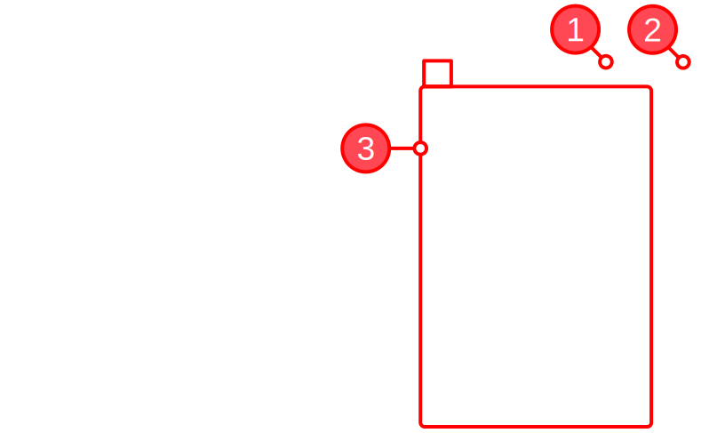

[Панель инструментов *Порт*](#панель-инструментов-порт) содержит, кроме кнопок, еще такие элементы:

1. Список доступных портов.

2. Скорость обмена данными в бод/с.

3. Выпадающее меню с дополнительными настройками порта, отображается при щелчке по соответствующей кнопке.

Чтобы начать работу с портом и иметь возможность передавать и принимать данные, необходимо подключиться к порту. Выберите порт, задайте скорость и другие настройки, затем подключитесь — `Соединение > Подключиться`. Если порт свободен, не используется другими приложениями и к нему удалось подключиться, в заголовке приложения будет отображаться информация о подключенном порте и его настройках.

Такие настройки порта, как биты данных, бит четности и стоп-биты доступны в выпадающем меню кнопки `Дополнительные настройки порта`.

## Список доступных портов

При запуске приложения происходит поиск зарегистрированных в системе портов. Список портов отображается на панели инструментов `Порт`. Если в процессе работы с терминалом физически подключить или отключить новое устройство, то список не изменится автоматически. Его необходимо обновить вручную: команда `Соединение > Сканировать`.

При сканировании также определяется доступен ли порт для подключения путем попытки подключиться к нему. Если порт занят, то в списке напротив этого порта указывается состояние `< занят >`. Проверку доступности можно отключить в настройках: вкладка `Связь`, флажок `Проверять доступность порта при сканировании`.

## Сигналы RS-232

Панель стандартных сигналов [RS-232](https://en.wikipedia.org/wiki/RS-232) позволяет контролировать эти сигналы порта. Чтобы отобразить ее, активируйте кнопку-флаг `Соединение > Панель сигналов`.

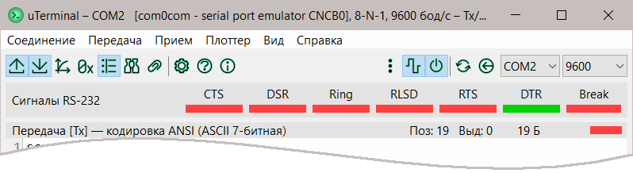

Состояние сигналов отображается индикаторами: красный — выключен, `0`; зеленый — включен, `1`.

Сигналы `Break`, `RTS`, `DTR` доступны для управления вручную: переключить состояние можно кнопкой-подписью над индикатором.

Если включена опция `Включить аппаратное управление потоком (RTS/CTS)` в настройках на вкладке `Связь`, то возможность ручного управления состоянием сигналов `RTS` и `DTR` отсутствует.

# Прием

По умолчанию прием начинается сразу же после подключения к порту. Можно приостановить прием (без отключения от порта), деактивировав кнопку-флаг `Соединение > Включить прием`. Команды управления приемником находятся в меню `Прием`.

Буфер приема нельзя редактировать. Его содержимое можно сохранить в текстовый файл (`Прием > Сохранить данные в файл ...`) или скопировать в буфер обмена (`Прием > Скопировать данные`).

## Кодировка и представление данных

Содержимое буфера принятых данных может отображаться следующим образом:

- представление `Текст` — текстом в выбранной кодировке (отображается в заголовке поля);

- представление `HEX`, `BIN`, `DEC` — в виде значений байтов, кодировка не имеет значения.

Изменение представления данных или кодировки не влияет на полученные данные, а только изменяет их отображение.

| Предст. | Элементы | Система счисления | Пример отображения                               |
|:------- |:--------:|:-----------------:|:------------------------------------------------ |
| Текст   | Символы  | —                 | `hello world`                                    |
| HEX     | Байты    | 16                | `68 65 6C 6C 6F 20 77 6F 72 6C 64`               |
| BIN     | Байты    | 2                 | `01101000 01100101 01101100 01101100 01101111` … |
| DEC     | Байты    | 10                | `104 101 108 108 111 32 119 111 114 108 100`     |

## Прокрутка к концу

Активируйте кнопку-флаг `Прием > Прокручивать к концу`, чтобы при приеме данных всегда видеть последние принятые данные. Это может быть удобным при приеме периодических данных, например, отладочных или журнала событий.

Если этот флаг не установлен, то при поступлении новых данных не будет происходить прокрутка к концу. Это позволяет анализировать ранее принятые данные, продолжая получать новые.

## Автоматический ответ

Команды раздела `Автоматический ответ` в меню `Прием` позволяют настроить и включить автоматический ответ. Когда эта функция активна, каждый поступивший пакет данных сравнивается с сохраненными последовательностями и если обнаружено совпадение, передатчик отправляет ответную последовательность.

Команда `Прием > Таблица ответов ...` открывает окно **Автоответ**, где можно задать входные и ответные последовательности.

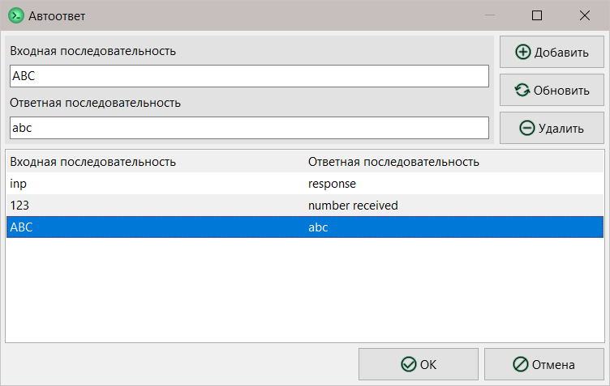

## Прочие опции

Дополнительные настройки приема смотрите в настройках на вкладке `Прием`.

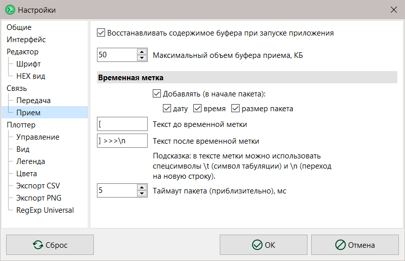

# Передача

Передатчик активируется сразу же после подключения к порту. Команды управления передатчиком находятся в меню `Передача`.

## Редактирование

Буфер передачи доступен для редактирования. Можно ввести такие данные:

- представление `Текст` — текст в выбранной кодировке (отображается в заголовке поля);

- представление `HEX`, `BIN`, `DEC` — значения байтов, разделенные не менее чем одним пробелом или переносом, кодировка не имеет значения.

| Представление | Элементы | Система счисления | Допустимые символы ввода                     |
| ------------- |:--------:|:-----------------:| -------------------------------------------- |
| Текст         | Символы  | —                 | Все, поддерживаемые кодировкой               |
| HEX           | Байты    | 16                | Цифры **0—9** и латинских букв **A—F** (\*1) |
| BIN           | Байты    | 2                 | Цифры **0** и **1** (\*1)                    |
| DEC           | Байты    | 10                | Цифры **0—9** (\*1)                          |

> (*1) Другие символы будут проигнорированы, регистр не имеет значения.

Данные также можно загрузить из файла — `Передача > Загрузить данные из файла ...`.

Кнопка `Вставка произвольного символа` поможет вставить любой символ в выбранной кодировке, например, отсутствующий на клавиатуре или непечатный.

## Отправка

Буфер передачи не передается автоматически. Инициируйте передачу, выполнив команду `Передача > Отправить`.

Если активировать кнопку-флаг `Передача > Автомат`, то буфер передачи будет автоматически передаваться через заданные интервалы времени. Интервал в миллисекундах задается в поле справа от кнопки, поле появляется только если автоматическая передача активна.

Если после передачи данных необходимо каждый раз очищать буфер, то можно включить эту возможность командой-флагом `Передача > Командный режим`.

## Список сохраненных сообщений

Для более удобной отправки повторяющихся данных можно воспользоваться списком сохраненных последовательностей (сообщений), активировав флаг `Показать` в меню `Передача`, раздел **Список сохраненных последовательностей**. Этот раздел содержит команды управления списком. Эти же команды доступны на панели инструментов списка.

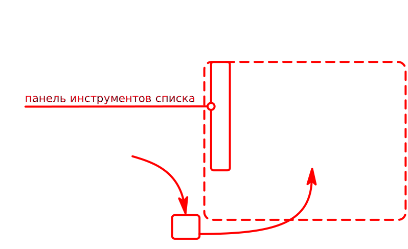

| Кнопка                           | Комбинация `Ctrl` + `Alt` + | Команда списка    | Действие                                                                                                                   |
|:--------------------------------:|:---------------------------:|:-----------------:| -------------------------------------------------------------------------------------------------------------------------- |
|           | `Q`                         | Добавить          | Добавляет в конец списка сообщение с содержимым буфера передачи                                                            |
|          | `R`                         | Удалить           | Удаляет из списка выбранное сообщение                                                                                      |
|    | `U`                         | Обновить          | Обновляет выбранное сообщение, заменяя его содержимым буфера передачи                                                      |
|     | `G`                         | Получить          | Обновляет буфер передачи, заменяя его содержимым выбранного сообщения                                                      |
|       | `Z`                         | Переместить вверх | Перемещает выбранное сообщение на одну позицию вверх в списке                                                              |
|     | `X`                         | Переместить вниз  | Перемещает выбранное сообщение на одну позицию вниз в списке                                                               |
|  | `Enter`                     | Отправить         | Передает содержимое выбранного сообщения (можно также передать двойным щелчком левой кнопки мыши по выделенному сообщению) |

### Заголовок сообщения

По умолчанию сообщение в списке отображается в исходном виде. Если сообщение имеет непечатные или трудночитаемые символы, может быть удобно вместо содержимого отобразить заголовок-псевдоним. Зайдите в режим редактирования заголовка: выделите сообщение в списке мышью, затем щелкните правой кнопкой по нему. Введите текст заголовка.

Сообщение с заголовком, отличающимся от содержимого, отображается курсивом. Увидеть исходное содержимое можно во всплывающей подсказке при наведении курсора мыши на сообщение.

Если заголовок нужно удалить, снова войдите в режим редактирования и удалите его.

> **Обратите внимание**.
> 
> Заголовок *не* является частью сообщения и *не* передается!

## Прочие опции

Дополнительные настройки передачи смотрите в настройках на вкладке `Передача`.

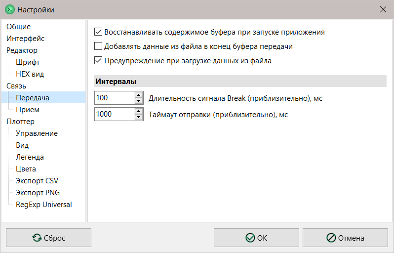

# Поиск и замена

Панель поиска можно открыть активировав кнопку-флаг `Вид > Поиск`.

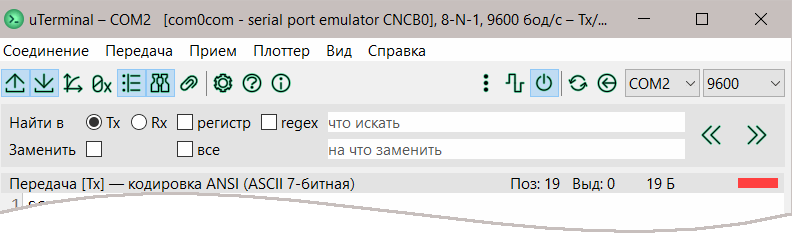

## Поиск

Введите в поле поиска (с подсказкой `что искать`) искомую строку. Убедитесь, что флажок `Заменить` снят. Выполните поиск, нажав кнопку `Найти предыдущее совпадение` или `Найти следующее совпадение`. Кнопки работают относительно текущего положения курсора.

Найденный фрагмент автоматически выделяется, а курсор устанавливается на его начало или конец, в зависимости от направления поиска. Если необходимо учитывать регистр искомого текста, установите флажок `с учетом регистра`.

Также можно осуществлять поиск по регулярному выражению.

> **Не знаете, что такое *регулярные выражения* и как их использовать?**
> 
> Быстро изучить тему можно в [wiki](https://en.wikipedia.org/wiki/Regular_expression). Также желательно изучить хотя бы одну из многих доступных книг по регулярным выражениям. Приложение использует библиотеку [TRegExpr](https://github.com/andgineer/TRegExpr) для работы с регулярными выражениями, с особенностями которой можно ознакомиться на странице [документации](https://regex.sorokin.engineer/en/latest/regular_expressions.html).

## Замена

Замена доступна только для буфера передачи, поскольку его можно редактировать.

Убедитесь, что флажок `Заменить` установлен. Замена работает так же, как и поиск, но найденный фрагмент заменяется на содержимое поля замены (с подсказкой `на что заменить`).

Чтобы заменить все совпадения разом, установите флажок `все`. Учтите, множественная замена работает *от курсора* в выбранном направлении!

Если для поиска используется регулярное выражение, то замена также выполняется по правилам регулярных выражений. Краткая подсказка по составлению шаблона замены для регулярного выражения:

- `$` — символ подстановки нумерованной группы,

- `\` — экранирование служебных символов (например, чтобы вставить символ `$` используйте `\$`),

- `{ }` — для отделения номера группы от цифры используйте фигурные скобки.

# Плоттер

В приложении реализован продвинутый плоттер, который имеет такие основные возможности:

- поддержка [формата Arduino](#формат-данных-arduino-advanced) с расширенными возможностями,
- поддержка [формата RegExp Universal](#формат-данных-regexp-universal) — заданный пользователем на основе регулярных выражений,
- поддержка [форматов "сырых" данных](#форматы-данных-raw),
- поддержка управляющих [команд](#команды) (очистка, сброс и т. д.),
- до 16 линий, каждой из которых можно задать свой цвет, стиль, толщину, размер точек,
- 3 основных [режима отображения](#режимы-отображения): *стандартный*, *2D* и *развертка*,
- 2 [режима вывода](#режимы-вывода): *live* и *накопление данных*,
- экспорт данных в [CSV](#экспорт-в-csv),
- экспорт изображения в [PNG](#экспорт-в-png),
- гибкая [настройка отображения линий](#настройка-отображения-линий): цвет, стиль, толщина, точки,
- [трекер точек](#трекер-точек) на линиях,
- и другие полезные опции.


## Запуск

Чтобы начать работать с плоттером нужно выполнить следующие действия в любой последовательности:

1. Подключиться к [порту](#порт).

2. Открыть плоттер: команда `Плоттер > Переключиться на плоттер`.

3. Настроить параметры плоттера при необходимости.

Поскольку плоттер работает со *входящими* данными, то он перекрывает буфер приема. Когда открыт плоттер, буфер приема недоступен для просмотра. При этом по умолчанию в него также не записываются входящие данные. Однако, если поступающие на плоттер данные необходимо записать для дальнейшего просмотра, установите в настройках на вкладке `Плоттер` флажок `Дублировать данные в буфер приема`.

Буфер передачи независим от плоттера. Скрыть или отобразить буфер, передавать данные и выполнять другие операции с ним можно в любой требуемый момент.

## Интерфейс

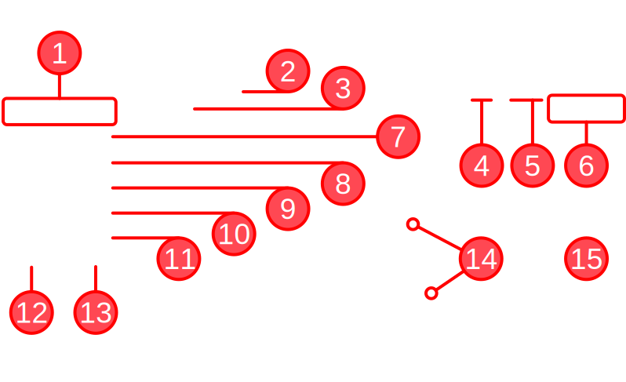

Элементы интерфейса плоттера:

1. [Панель инструментов](#панель-инструментов) плоттера.

2. Заголовок, выводит формат данных и режим отображения.

3. Интерактивная [легенда](#легенда).

4. Количество поступивших семплов.

5. Количество поступивших данных.

6. [Панель управления](#панель-управления) плоттером.

7. Ширина окна в семплах (в [*Live*-режиме](#режимы-вывода) или в режиме отображения *развертка*).

8. [Режим отображения](#режимы-отображения).

9. [Формат](#форматы-данных) входных данных.

10. [Предустановка](#предустановки) RegExp (отображается, когда выбран [формат *RegExp Universal*](#формат-данных-regexp-universal)).

11. [Стиль](#параметры-линий-по-умолчанию) линии по умолчанию.

12. [Толщина](#параметры-линий-по-умолчанию) линии по умолчанию.

13. [Размер точек](#параметры-линий-по-умолчанию) линии по умолчанию.

14. Линии.

15. Область просмотра линий.

### Панель управления

Панель управления плоттером расположена в правом верхнем углу плоттера, содержит три основные кнопки.

| Кнопка                          | Комбинация     | Меню    | Команда в меню    | Что делает                                                     |
|:-------------------------------:|:--------------:|:-------:|:-----------------:| -------------------------------------------------------------- |
| 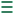 | `Ctrl` + `B`   | Плоттер | Быстрая настройка | Переключает видимость панели быстрой настройки                 |
|   | `Ctrl` + `W`   | Плоттер | Очистить          | Очищает плоттер                                                |
|   | [`Ctrl` + `P`] | —       | Закрыть           | Закрывает плоттер и переключается на отображение буфера приема |

### Панель быстрой настройки

Панель быстрой настройки расположена слева от плоттера. Она предоставляет доступ к параметрам быстрой настройки и командам плоттера.

#### Параметры быстрой настройки

| Параметр              | Отображается                             | Что настраивает                                                                                                                                       |
| --------------------- |:----------------------------------------:| ----------------------------------------------------------------------------------------------------------------------------------------------------- |
| Ширина окна в семплах | В *Live-режиме* или в режиме *развертка* | Задает, сколько семплов выводится в плоттере в  [Live-режиме](#режимы-вывода) или в режиме отображения *развертка*                                    |
| Режим отображения     | Всегда                                   | Устанавливает один из трех [режимов отображения](#режимы-отображения): *стандартный*, *2D* или *развертка*                                            |
| Формат входных данных | Всегда                                   | Задает, согласно какому [формату](#форматы-данных) должны интерпретироваться входные данные: *Arduino Advanced*, *RegExp Universal* или *Raw-форматы* |
| Предустановка RegExp  | Когда выбран формат *RegExp Universal*   | Задает [регулярное выражение](#формат-данных-regexp-universal), по которому будет идти поиск входных значений                                         |
| Стиль линии           | Всегда                                   | Задает стиль всех линий плоттера по умолчанию                                                                                                         |
| Толщина линии         | Всегда                                   | Задает толщину всех линий плоттера по умолчанию                                                                                                       |
| Размер точек линии    | Всегда                                   | Задает размер точек всех линий плоттера по умолчанию                                                                                                  |

#### Панель инструментов

В самом верху панели быстрой настройки есть панель инструментов. Эти же команды можно найти и в меню `Плоттер`.

| Кнопка                           | Комбинация            | Команда в меню | Что делает                                                                                                              |
|:--------------------------------:|:---------------------:|:--------------:| ----------------------------------------------------------------------------------------------------------------------- |
| `CSV`                            | `Shift` + `Alt` + `C` | Экспорт в CSV  | Экспортирует все содержимое плоттера в формате CSV. Параметры экспорта можно задать в настройках: вкладка `Экспорт CSV` |
| `PNG`                            | `Shift` + `Alt` + `P` | Экспорт в PNG  | Сохраняет скриншот плоттера в формате PNG. Параметры экспорта можно задать в настройках: вкладка `Экспорт PNG`          |
|  | `Ctrl` + `H`          | Трекер         | Переключает активность инструмента отслеживания точек на линиях                                                         |
|     | `Ctrl` + `L`          | Live-режим     | Переключает режим вывода. Включено — *Live-режим*. Отключено — *режим накопления*                                       |

### Навигация и масштабирование

Плоттер имеет простые и интуитивно понятные инструменты управления навигацией и масштабом.

#### Навигация

Перемещение по области отображения плоттера может помочь отыскать конкретный участок линии или точку на ней. Чтобы переместить область просмотра, просто потяните мышью за нее. При перемещении курсор изменяет свой вид на всенаправленную стрелку.

> **Примечание**.
> 
> В [*Live-режиме*](#режимы-вывода) навигация ограничена.

#### Масштабирование

Область отображения плоттера можно масштабировать по обеим осям. Для этого используется колесо мыши. По умолчанию, колесо мыши изменяет масштаб по оси X, а колесо с зажатым `Ctrl` — по оси Y.

Щелчок левой кнопкой мыши с зажатым `Ctrl` по области просмотра установит автоматический масштаб, т. е. все содержимое плоттера будет вписано в видимую область просмотра. Также автоматический масштаб всегда устанавливается при сбросе плоттера.

При установке автоматического масштаба легенда может перекрывать линии плоттера. Чтобы улучшить внешний вид, в настройках на вкладке `Плоттер: Вид` можно задать фиксированные отступы сверху и снизу для оси Y.

В настройках на вкладке `Плоттер: Управление` можно изменить способ и коэффициент масштабирования. Коэффициент определяет, во сколько раз увеличивается (или уменьшается) масштаб на следующем шаге. Например, при коэффициенте `1,5` каждый следующий шаг будет увеличивать масштаб в 1,5 раза. Если коэффициент меньше 1, то направление масштабирования изменяется на противоположное. Это достаточно очевидно, так как, например, увеличение в 0,8 раз эквивалентно уменьшению в 1,25 (1/0,8) раз.

> **Примечание**.
> 
> В [*Live-режиме*](#режимы-вывода) масштабирование по оси X имеет другое поведение.

### Трекер точек

Трекер — это инструмент, который позволяет отслеживать точки линии.

Команда-флаг `Плоттер > Трекер` переключает активность инструмента.

Когда трекер активен, то при наведении курсора на точку линии появляется перекрестие и подсказка с координатами точки.

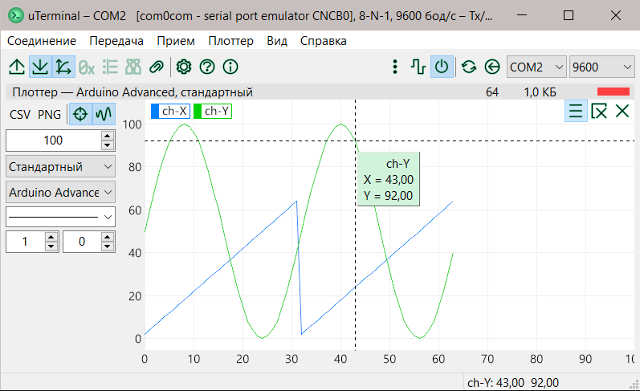

### Настройка внешнего вида

Внешний вид плоттера можно гибко настроить. В окне настроек можно задать:

1. Вкладка `Плоттер: Цвета`:
   
   - цвета фона, текста, сетки.
     
     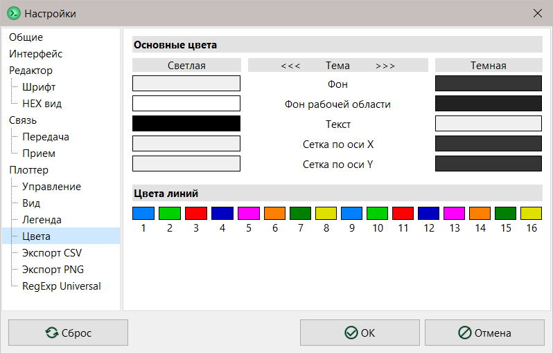

2. Вкладка `Плоттер: Вид`:
   
   - отображение сетки и меток каждой из осей;
   
   - отображение счетчика семплов.
     
     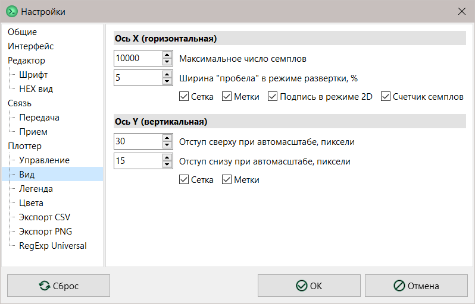

3. Вкладка `Плоттер`:
   
   - отображение количества поступивших данных;
   
   - субпиксельное сглаживание: улучшает рендеринг линий, но может немного уменьшать частоту отрисовки.
     
     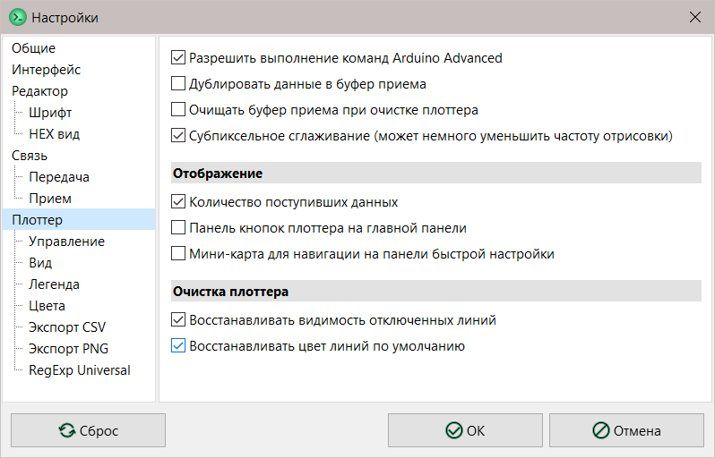

## Настройка отображения линий

Плоттер имеет гибкую настройку параметров отображения линий, как всех одновременно, так и каждой по отдельности. Параметры всех линий одновременно задаются настройками по умолчанию.

Кроме того, каждая линия может иметь параметры, независимые от заданных по умолчанию. Можно настроить толщину, стиль, цвет и размер точек каждой отдельной линии. Это можно сделать двумя способами:

1. **Из приложения**, используя возможности [интерактивной](#интерактивность) легенды.

2. **Входными данными**, используя [дополнительные поля](#дополнительные-поля) линии (только формат *Arduino Advanced*).

### Параметры линий по умолчанию

На панели быстрой настройки можно задать следующие параметры линий по умолчанию:

1. Стиль: 6 вариантов (см. таблицу стилей линий в [Дополнительные поля](#дополнительные-поля)).

2. Толщина: от 1 до 10 пикселей.

3. Размер точек: радиус от 0 до 10 пикселей. Точки не отображаются, если значение равно 0.

Цвет линий по умолчанию можно задать в настройках на вкладке `Плоттер: Цвета`.

Изменение параметров по умолчанию приводит к немедленному их применению.

## Форматы данных

Плоттер поддерживает несколько разных форматов входных данных:

1. **Arduino Advanced**: расширенный формат плоттера Arduino.

2. **RegExp Universal**: определяемый пользователем на основе регулярных выражений.

3. **Raw-форматы**: простой поток машинных слов.

Выбрать формат можно на панели быстрой настройки.

### Формат данных Arduino Advanced

Плоттер имеет полную поддержку стандартного формата плоттера *Arduino IDE v1*. Кроме того, формат расширен для поддержки таких опций:

1. Целочисленные значения в различных системах счисления. [-->](#целочисленные-значения)

2. Значение NaN. [-->](#значение-nan)

3. Дополнительные поля. [-->](#дополнительные-поля)

4. Команды. [-->](#команды)

> **Интересно знать**.
> 
> Поиск и выделение значений из строки входных данных осуществляется с помощью следующего регулярного выражения (одной строкой, разбито для лучшего отображения):
> 
> ```regex
> (?:(\|)?([^\s,:|]+)(\|[^\s,: ]*)?[\t ]*:[\t ]*|^|[\t, ])
> (?:(?:(0x|\$|h|x|b|d|o)([\da-f]+))|nan|n|
> ([\-+]?(?:\d+\.\d*|\.\d+|\d+)(?:e[\-+]?\d+)?))(?=[,\s$])
> ```

#### Стандартный формат плоттера Arduino IDE v1

Данные должны поступать текстовой строкой, оканчивающейся символом перехода на новую строку `\n` (код 13). Строка может содержать несколько значений в десятичной записи, в т. ч. в экспоненциальной форме. Каждое значение может иметь метку. Значения должны отделяться друг от друга минимум одним символом-разделителем. Это запятая, пробел или горизонтальная табуляция (код 9). Регистр не имеет значения, но сохраняется при отображении меток.

Например, строка `Int:100,Float:200.0,\t250.5, 3.2e2 , 3405E-1 \n` выведет следующие линии:

1. Метка `Int` — значение `100`.
2. Метка `Float` — значение `200.0`.
3. Без метки — значение `250.5`.
4. Без метки — значение `320`.
5. Без метки — значение `340.5`.

А вот как выглядит формальная запись стандартного формата в РБНФ ([EBNF](https://en.wikipedia.org/wiki/Extended_Backus%E2%80%93Naur_form)):

```rbnf
<plotString>    = <plotValue>{<delimeter><plotValue>}<eol>
<plotValue>     = [<label>":"]<value>{<delimeter>}
<value>         = ["+"|"-"]<number>["."[<number>]][("e"|"E")["+"|"-"]<number>]
<number>        = <digit>{<digit>}
<label>         = <labelChar>{<labelChar>}
<labelChar>     = <letterLo>|<letterHi>|<digit>|"-"|"."|"="
<letterLo>      = "a"|...|"z"
<letterHi>      = "A"|...|"Z"
<digit>         = "0"|...|"9"
<delimeter>     = " "|","|"\t"
<eol>           = "\n"
```

#### Целочисленные значения

Формат *Arduino Advanced* поддерживает целочисленные значения в различных системах счисления. Если число задано в системе счисления, которая отличается от десятичной, перед ним необходимо указать соответствующий префикс.

| Система           | Система | Основание | Префикс             |
| ----------------- |:-------:|:---------:|:-------------------:|
| Двоичная          | `BIN`   | 2         | `b`                 |
| Восьмеричная      | `OCT`   | 8         | `o`                 |
| Десятичная        | `DEC`   | 10        | нет или `d`         |
| Шестнадцатеричная | `HEX`   | 16        | `0x`, `$`, `h`, `x` |

Например, строка `vdec:d123,vhex:0xff,vbin:b1010\n` выведет следующие линии:

1. Метка `vdec` — значение `123`.
2. Метка `vhex` — значение `255`.
3. Метка `vbin` — значение `10`.

#### Значение NaN

Формат *Arduino Advanced* поддерживает значение `NaN` (Not a Number). Это значение не отображается и, соответственно, прерывает отрисовку линии. Это так называемая *выколотая точка*. Чтобы задать значение *NaN*, используйте `n` или `nan`.

Например, строка `ch-X:12,ch-Y:nan\n` выведет следующее (см. скриншот):

1. Метка `ch-X` — значение `12`, точка отображается.
2. Метка `ch-Y` — значение `NaN`, точка не отображается.

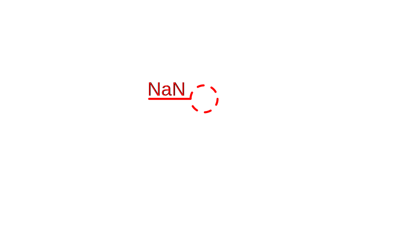

#### Дополнительные поля

Формат *Arduino Advanced* поддерживает дополнительные поля. Они расширяют возможности настройки линий. Дополнительные поля добавляется в конце метки, их может быть несколько. Каждое поле начинается с символа вертикальная черта `|`, сразу за которым следует ключ и значение.

> **Обратите внимание**.
> 
> Все три элемента поля — вертикальная черта, ключ и значение — должны следовать друг за другом непосредственно, между ними не должно быть никаких других символов!

Нет необходимости задавать дополнительные поля в каждой строке. Они увеличивают длину строки и, соответственно, уменьшают скорость поступления новых данных. Достаточно задать их только один раз для каждой линии, например, в начале сеанса. Заданные параметры будут сохраняться до очистки плоттера или изменения параметров линий по умолчанию.

Поддерживаются следующие дополнительные поля:

| Ключ | Описание      | Значение                                   | Пример                  |
|:----:|:------------- | ------------------------------------------ | ----------------------- |
| `c`  | Цвет линии    | RGB-HEX-цвет (формат A, ABC или ABCDEF)    | `cF`, `cFFF`, `cFFFFFF` |
| `w`  | Толщина линии | Толщина в пикселях                         | `w3`                    |
| `s`  | Стиль линии   | Индекс, см. таблицу ниже                   | `s1`                    |
| `p`  | Точки         | Радиус точки в пикселях, 0 — не отображать | `p4`                    |

Поддерживаемые стили линии:

| Индекс | Тип               |
|:------:| ----------------- |
| 0      | Сплошная          |
| 1      | Штрихи            |
| 2      | Точки             |
| 3      | Штрих-точка       |
| 4      | Штрих-точка-точка |
| 5      | Прозрачная        |

Например, строка `SomeData|cF00|w2|s1:100\n` выведет штриховую (`s1`) линию красного цвета (`cF00`) толщиной 2 px (`w2`) со значением 100 и меткой `SomeData`.

> **Интересно знать**.
> 
> Можно динамически изменять цвет линии во время работы плоттера, например, если значение вышло за допустимые пределы. Разумеется, делать все это должно приложение, которое посылает данные на плоттер.

#### Команды

Формат *Arduino Advanced* поддерживает команды. Команда дает указание плоттеру выполнить некоторое действие. Команда выглядит как значение без метки, но с дополнительным полем:

```
|<command>:<value>
```

Идентификаторы команд `<command>` имеют 2 формы: короткую — 1 или 2 символа, и долгую — до 5 символов.

По умолчанию исполнение команд разрешено. Иногда это не требуется или даже может мешает нормальной работе. В таком случае исполнение команд можно отключить, сняв соответствующий флажок в настройках на вкладке `Плоттер`.

| Команда `<command>` | Описание                                                | Значение `<value>`                                    | Пример                    |
| ------------------- | ------------------------------------------------------- | ----------------------------------------------------- | ------------------------- |
| `c`, `clear`        | Очистка, удаляет заданное количество последних значений | Количество последних значений, 0 — все                | `\|c:100`, `\|clear:0`    |
| `r`, `reset`        | Сброс плоттера                                          | Любое                                                 | `\|r:0`, `\|reset:0`      |
| `x`, `xwin`         | Ширина окна в семплах                                   | Количество семплов по оси Х, 0 — настройки приложения | `\|x:200`, `\|xwin:0`     |
| `g`, `grid`         | Видимость сетки по обеим осям                           | 0 — не отображать, иначе отображать                   | `\|g:1`, `\|grid:0`       |
| `xg`, `xgrid`       | Видимость сетки по оси X (вертикальные линии)           | 0 — не отображать, иначе отображать                   | `\|xg:1`, `\|xgrid:0`     |
| `yg`, `ygrid`       | Видимость сетки по оси Y (горизонтальные линии)         | 0 — не отображать, иначе отображать                   | `\|yg:1`, `\|ygrid:0`     |
| `bg`, `back`        | Цвет фона                                               | RGB-HEX-цвет (формат A, ABC или ABCDEF)               | `\|bg:FFF`, `\|bg:88FF88` |
| `w`, `width`        | Толщина всех линий                                      | Толщина линий в пикселях, 0 — настройки приложения    | `\|w:2`, `\|width:1`      |
| `p`, `point`        | Размер точек на линиях                                  | Размер точек, 0 — не отображать                       | `\|p:3`, `\|points:0`     |
| `v`, `view`         | [Режим отображения](#режимы-отображения)                | 0 — стандартный, 1 — 2D, 2 — развертка                | `\|v:1`, `\|view:0`       |

### Формат данных RegExp Universal

Этот формат фактически является полностью определяемым пользователем. Единственное неизменяемое в нем то, что каждая новый семпл данных должен оканчиваться символом конца строки: `\n` или `\r`. Поиск меток и значений во входной строке осуществляется по регулярному выражению. Метка и значение конструируются при помощи подстановки из выделенных регулярным выражением групп.

Метка может состоять из любых символов.

Значение может быть представлено в таких видах:

1. Целое число: `100` или `-200`. Перед целыми числами может быть указан префикс (`$` — число в HEX, `%` — BIN, `&` — OCT). Число, состоящее только из цифр и без префикса перед ним, интерпретируется как обычное десятичное целое. Например, `$ff` — число 255.

2. С плавающей точкой: `12.34` или `-0.123`.

3. В экспоненциальной форме: `1.2e3` или `-1.2E-2`.

4. Все другие комбинации символов — `NaN`.

> **Не знаете, что такое *регулярные выражения* и как их использовать?**
> 
> Быстро изучить тему можно в [wiki](https://en.wikipedia.org/wiki/Regular_expression). Также желательно изучить хотя бы одну из многих доступных книг по регулярным выражениям. Приложение использует библиотеку [TRegExpr](https://github.com/andgineer/TRegExpr) для работы с регулярными выражениями, с особенностями которой можно ознакомиться на странице [документации](https://regex.sorokin.engineer/en/latest/regular_expressions.html).

#### Предустановки

Чтобы можно было задать несколько разных пользовательских форматов используются предустановки. Каждая предустановка имеет свое название и включает в себя регулярное выражение, подстановку для получения метки и подстановку для получения значения. Управление списком предустановок осуществляется в настройках на вкладке *RegExp Universal*.

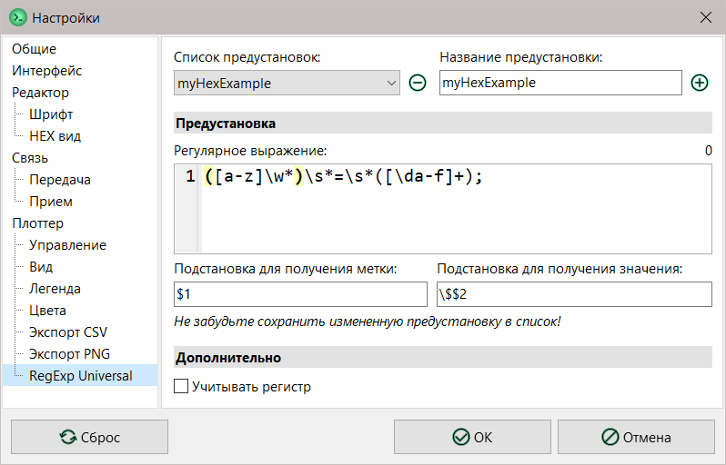

По умолчанию регулярные выражения обрабатываются без учета регистра. Если учитывать регистр необходимо, установите соответствующий флажок в настройках на вкладке *RegExp Universal*.

> **Обратите внимание**.
> 
> Изменение учета регистра влияет на все предустановки!

#### Как это работает

По умолчанию в списке предустановок есть только один элемент — `(default)`, представленный для примера. Рассмотрим его и разберемся, как это работает.

Задано регулярное выражение `(?<=\s)(\w+)=(\d+)(?=\s)`.

Первая группа `(?<=\s)` — это позитивный просмотр назад, она указывает, что перед искомой подстрокой должен быть пробельный символ. Последняя группа `(?=\s)` — это позитивный просмотр вперед, она указывает, что после искомой подстроки должен быть пробельный символ. Эти группы не нумеруются.

Группа `(\w+)` указывает искать один или более буквенных или цифровых символов. Символ `=` собственно его и ищет. А группа `(\d+)` ищет один или более цифровых символов. Эти две группы нумеруются. Первой из них присваивается индекс 1, второй — 2.

Например, в строке `a=11 b=22 c=33\n` это регулярное выражение сможет найти сперва подстроку `b=22`, а на следующей итерации `c=33`. А вот подстрока `a=11` не будет найдена, так как она не начинается с пробельного символа (за это отвечает часть `(?<=\s)`). А строка `c=33` находится потому, что символ `\n` является пробельным для парсера регулярных выражений.

Подстановка для получения метки имеет вид `$1`. Это значит, что нумерованная группа с индексом 1 будет интерпретироваться как метка. Подстановка для получения значения имеет вид `$2`. Это значит, что нумерованная группа с индексом 2 будет интерпретироваться как значение. Таким образом, из найденной подстроки `b=22` получаем метку `b` и значение `22`.

Как можно было догадаться, здесь описан очень простой формат данных, похожий на стандартный формат Arduino, но еще более простой: разделители значений — только пробелы, распознаются только целые положительные числа, а метка отделяется от значения символом `=`.

#### Пример

Рассмотрим практический пример. Допустим, имеется входная информация в виде `register = 12ab;`. Это могут быть, например, отладочные данные о состоянии какого-то регистра в HEX. Составим регулярное выражение для предустановки *RegExp Universal*.

Имя регистра будет всегда начинаться с буквы, но в нем могут быть цифры и знак подчеркивания: `[a-z]\w*`. Значение в HEX состоит из минимум одной шестнадцатеричной цифры: `[\da-f]+`. Так как метку и значение необходимо будет выделить, то используем группы. Полное выражение: `([a-z]\w*)\s*=\s*([\da-f]+);`. Для выделения метки укажем подстановку `$1`, а значения — `\$$2`. Так как значение поступает в HEX, то указываем перед подставленной группой `$2` символ-префикс `$`, но поскольку символ `$` является управляющим, то его необходимо экранировать обратной чертой `\`.

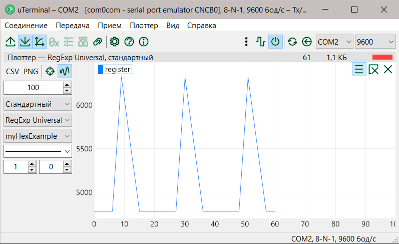

#### Как составлять регулярные выражения

Чтобы облегчить создание своего формата на основе регулярных выражений, воспользуйтесь следующими советами:

1. Используйте редактор регулярных выражений. Это облегчит и ускорит составление и отладку выражения. Это может быть как [онлайн-редактор](https://regexr.com/), так и классическое приложение.

2. Заготовьте список примеров для разрабатываемого формата и проверяйте работу регулярного выражения на нем. Это поможет составить полное и правильное выражение.

3. Если используете редактор, не забывайте, что существуют разные диалекты регулярных выражений. При вставке отлаженного выражения в список предустановок *RegExp Universal* убедитесь, что выражение будет правильно обрабатываться. Для этого изучите [документацию](https://regex.sorokin.engineer/en/latest/regular_expressions.html) по библиотеке *TRegExpr*.

### Форматы данных Raw

Плоттер поддерживает простейший Raw ("сырой") формат данных. Данные должны поступать в виде последовательности машинных слов с порядком байтов от старшего к младшему [Big-Endian](https://en.wikipedia.org/wiki/Endianness). Каждое слово — отдельное значение единственной линии с меткой `Raw __` (см. таблицу).

| Формат                | Метка   | Длина слова, байт | Знаковый           | Пример, число 15, HEX |
| --------------------- | ------- |:-----------------:|:------------------:| --------------------- |
| Raw uint8 Big-Endian  | Raw u8  | 1                 | :x:                | `0F`                  |
| Raw uint16 Big-Endian | Raw u16 | 2                 | :x:                | `00 0F`               |
| Raw uint24 Big-Endian | Raw u24 | 3                 | :x:                | `00 00 0F`            |
| Raw uint32 Big-Endian | Raw u32 | 4                 | :x:                | `00 00 00 0F`         |
| Raw int8 Big-Endian   | Raw i8  | 1                 | :heavy_check_mark: | `0F`                  |
| Raw int16 Big-Endian  | Raw i16 | 2                 | :heavy_check_mark: | `00 0F`               |
| Raw int24 Big-Endian  | Raw i24 | 3                 | :heavy_check_mark: | `00 00 0F`            |
| Raw int32 Big-Endian  | Raw i32 | 4                 | :heavy_check_mark: | `00 00 00 0F`         |

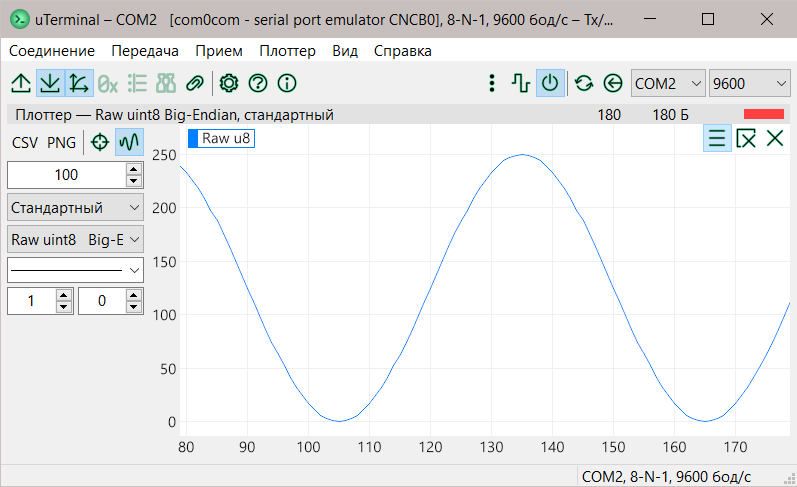

В режиме отображения [*2D*](#режимы-отображения) первое слово — значение по оси X, второе — по оси Y, следующее — снова по X и так далее. Также к метке линии добавляется суффикс `(Y)`, а метка оси X имеет такую же метку, но с суффиксом `(X)`.


## Режимы отображения

Плоттер имеет 3 режима отображения:

1. **Стандартный**. Каждая новая строка данных — новый семпл. Счетчик семплов задает координату X линий, увеличивается на 1 с каждым новым семплом. Значения из строки данных задают координату Y линий. Количество линий равно количеству значений в строке.
   
   

2. **2D**. Этот режим позволяет задавать координату X произвольно. Первое значение из строки данных — это координата по оси X, остальные значения — координаты Y линий. Таким образом становится возможным выводить линии по точкам с заданными обеими координатами. По умолчанию метка первого значения отображается внизу как подпись оси X. Это можно отключить в настройках на вкладке `Плоттер: Вид`.
   
   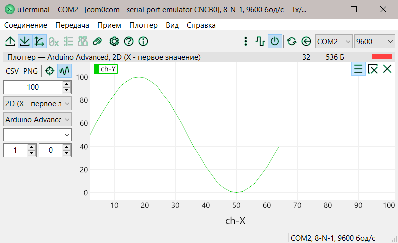

3. **Развертка**. Похож на *стандартный*, за исключением того, что счетчик семплов сбрасывается каждый раз, когда он превысит ширину окна, и данные начинают выводиться с начала. Таким образом, этот режим действительно напоминает развертку осциллографа. Справа от последнего семпла выводится чистая область — так называемый "пробел", его ширину можно задать в настройках на вкладке `Плоттер: Вид`. "Пробел" облегчает восприятие постоянно обновляемых данных, так как отчетливо отделяет новые данные от выведенных ранее.
   
   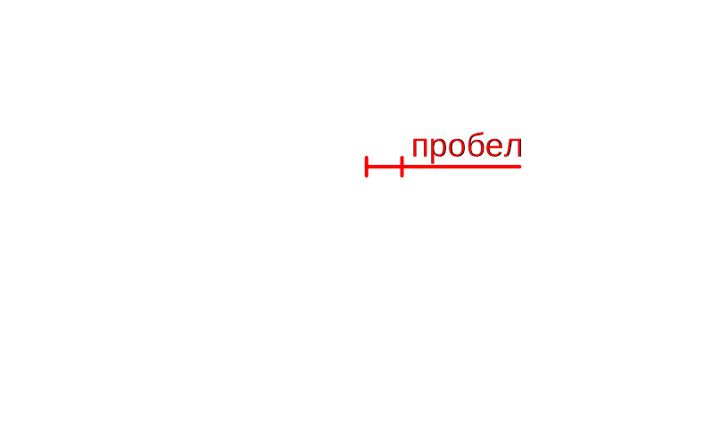

## Режимы вывода

Плоттер имеет 2 режима вывода линий:

1. **Live-режим**. Кнопка-флажок `Live-режим` нажата. 
   
   На экран выводятся только последние поступившие семплы, их количество задается настройкой `ширина окна в семплах`. Более старые семплы не отображаются, так как они вне области просмотра, но сохраняются, их общее количество задается настройкой `Максимальное число семплов` в настройках на вкладке `Плоттер: Вид`.
   
   Во время поступления новых семплов свободная навигация по осям недоступна. Также масштабирование по оси X имеет другое поведение — изменяется ширина окна в семплах с шагом в 2 раза. Если данные не поступают, то навигация доступна.
   
   

2. **Накопление**. Кнопка-флажок `Live-режим` *не* нажата. 
   
   Ось Y автоматически масштабируется так, чтобы в области просмотра отображались все поступившие семплы. Если в плоттер поступают новые семплы, линии кажутся сжимающимися по оси Y.
   
   В этом режиме всегда доступна свободная навигация и стандартное масштабирование по осям.
   
   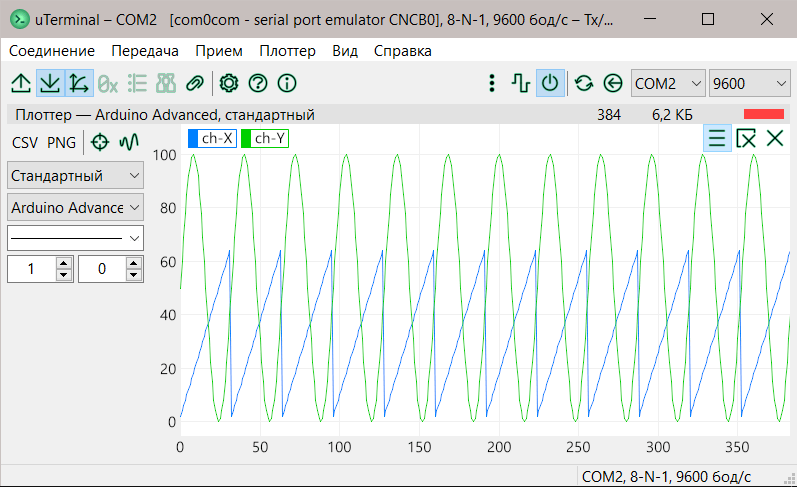

## Легенда

Легенда плоттера отображает метки линий. Легенда отображается вверху области просмотра плоттера, метки располагаются слева направо. Если все метки не умещаются в строке, они переносятся на следующую.

### Интерактивность

По умолчанию метки легенды интерактивны: они реагируют на жесты мышью. Это позволяет гибко настраивать каждую отдельную линию. Отключить это поведение можно в настройках на вкладке `Плоттер: Легенда` (см. [Настройки легенды](#настройки-легенды)).

> **Обратите внимание**.
> 
> Измененные с помощью жестов настройки линий действуют только в текущем сеансе. После перезапуска приложения линии получат настройки по умолчанию, которые заданы на панели быстрой настройки.

| Жест                                           | Действие                                                                                                                                         |
| ---------------------------------------------- | ------------------------------------------------------------------------------------------------------------------------------------------------ |
| Щелчок **ЛКМ** на метке                        | Переключает видимость линии; сама метка видима всегда                                                                                            |
| Зажать **ЛКМ** на метке и потянуть вниз        | Изменяет толщину линии: чем длиннее жест, тем более толстая линия. <br>Во время исполнения жеста выводится подсказка с текущим значением толщины |
| Зажать **Ctrl + ЛКМ** на метке и потянуть вниз | Изменяет стиль линии. <br>Во время исполнения жеста выводится подсказка с текущим стилем                                                         |
| Зажать **Alt + ЛКМ** на метке и потянуть вниз  | Изменяет размер (радиус) точек линии. <br>Во время исполнения жеста выводится подсказка с текущим значением размера точек                        |
| Щелчок **ПКМ** на метке                        | Открывает диалог задания нового цвета линии                                                                                                      |

*Подсказка*. ЛКМ — левая кнопка мыши, ПКМ — правая кнопка мыши.

### Настройки легенды

Настройки легенды находятся на вкладке `Плоттер: Легенда` в окне настроек.

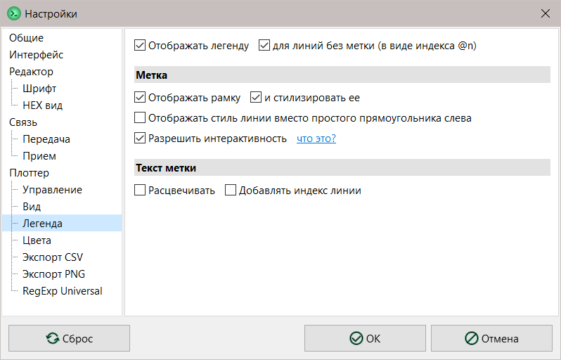

| Раздел      | Настройка                 | Действие                                                                                                                                                                                                                                                |
|:-----------:|:-------------------------:| ------------------------------------------------------------------------------------------------------------------------------------------------------------------------------------------------------------------------------------------------------- |
|             | Отображать легенду        | Если флажок не установлен, то легенда не будет отображаться вообще.                                                                                                                                                                                     |
|             | для линий без метки...    | Если флажок установлен, то линии без метки (т. е. метки которых не содержат ни одного символа) автоматически получат метку вида `@n`, где n — индекс линии. Если флажок не установлен, то линии без метки не будут отображаться в легенде.              |
| Метка       | Отображать рамку          | Устанавливает видимость рамки вокруг метки.                                                                                                                                                                                                             |
| ^           | и стилизировать ее        | Если флажок установлен, то рамка будет иметь цвет и стиль такой же, как и соответствующая ей линия.                                                                                                                                                     |
| ^           | Отображать стиль линии... | Если флажок установлен, то перед текстом метки будет отображаться короткая линия с тем же цветом и стилем, что и соответствующая ей линия плоттера. Если флажок не установлен, то будет отображаться простой прямоугольник цвета соответствующей линии. |
| ^           | Разрешить интерактивность | Если флажок установлен, то метки легенды будут реагировать на жесты мышью.                                                                                                                                                                              |
| Текст метки | Расцвечивать              | Если флажок установлен, то текст метки будет отображаться тем же цветом, что и соответствующая ей линия плоттера. Если флажок не установлен, метка будет отображаться цветом текста плоттера (вкладка `Плоттер:Цвета`).                                 |
| ^           | Добавлять индекс линии    | Если флажок установлен, то перед текстом метки будет добавлен индекс линии (начиная с 1).                                                                                                                                                               |

## Экспорт в CSV

Плоттер может экспортировать данные в формат `CSV` ([Comma-separated values](https://en.wikipedia.org/wiki/Comma-separated_values)).

Команда экспорта в CSV доступна на панели быстрой настройки или в меню `Плоттер`. Выполните ее, укажите имя файла в который будут выведены данные и сохраните файл.

> **Обратите внимание**.
> 
> Во время выполнения экспорта плоттер приостанавливается.

Для лучшей совместимости с другими программами можно задать необходимые параметры экспорта: разделитель данных, десятичный разделитель, кавычки и переход на новую строку. Эти параметры находятся в настройках на вкладке `Плоттер: Экспорт CSV`.

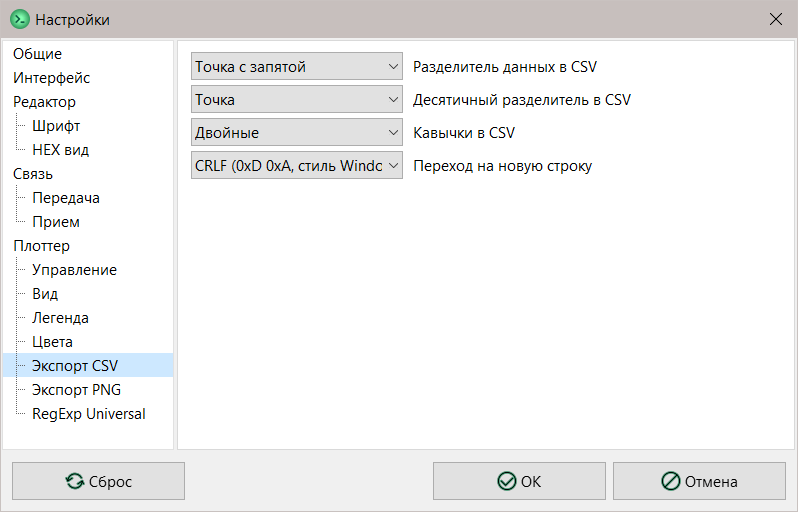

## Экспорт в PNG

Текущий вид плоттера можно сохранить в виде изображения, иначе говоря, сделать скриншот плоттера в `PNG`.

Команда экспорта в PNG доступна на панели быстрой настройки или в меню `Плоттер`. Выполните ее, укажите имя файла в который будет сохранен скриншот и сохраните файл.

> **Обратите внимание**.
> 
> Во время выполнения экспорта плоттер приостанавливается.

В настройках на вкладке `Плоттер: Экспорт PNG` можно задать параметры экспорта: размер изображения, размер шрифта и поведение диалога сохранения. Если флажок `Показывать диалог сохранения только один раз` установлен, то экспорт будет происходить следующим образом. После запуска приложения при первом экспорте изображения будет отображен диалог выбора каталога. Все последующие изображения будут экспортироваться в каталог, выбранный ранее. Имя файла будет сгенерировано на основе даты и времени экспорта.

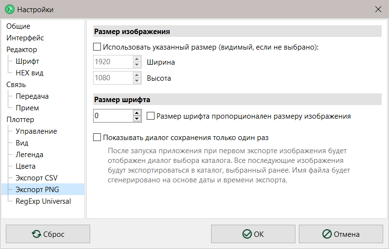

# Настройки

Для комфорта пользователя есть различные настройки внешнего вида и поведения приложения.

Команда-флаг `Вид > Поверх всех окон` управляет видимостью окна приложения — если флаг установлен, то приложение всегда будет отображаться поверх других окон, даже если оно теряет фокус.

Остальные настройки находятся в окне, которое можно вызвать командой `Соединение > Настройки`. Большинство настроек имеет понятное назначение, некоторые имеют дополнительную подсказку при наведении на них курсора мыши.


# Полезная информация

Ссылки на онлайн-ресурсы по теме:

| Тема                                             | wiki                                                                             | wiki (ru)                                                                       | Другие                                                                                                                          |
| ------------------------------------------------ | -------------------------------------------------------------------------------- | ------------------------------------------------------------------------------- | ------------------------------------------------------------------------------------------------------------------------------- |
| Универсальный асинхронный приёмопередатчик, UART | [>>>](https://en.wikipedia.org/wiki/Universal_asynchronous_receiver-transmitter) | [>>>](https://ru.wikipedia.org/wiki/Универсальный_асинхронный_приёмопередатчик) | [3d-diy.ru](https://3d-diy.ru/wiki/arduino-moduli/interfeys-peredachi-dannykh-uart/), [cxem.net](https://cxem.net/mc/mc129.php) |
| Последовательный порт                            | [>>>](https://en.wikipedia.org/wiki/Serial_port)                                 | [>>>](https://ru.wikipedia.org/wiki/Последовательный_порт)                      |                                                                                                                                 |
| RS-232                                           | [>>>](https://en.wikipedia.org/wiki/RS-232)                                      | [>>>](https://ru.wikipedia.org/wiki/RS-232)                                     | [softelectro.ru](http://www.softelectro.ru/rs232.html), [gaw.ru](http://www.gaw.ru/html.cgi/txt/interface/rs232)                |
| Нуль-модемное соединение                         | [>>>](https://en.wikipedia.org/wiki/Null_modem)                                  | [>>>](https://ru.wikipedia.org/wiki/Нуль-модемное_соединение)                   |                                                                                                                                 |

## Полезные ресурсы

1. [Null-modem emulator  (com0com)](http://com0com.sourceforge.net)

2. [Эмуляторы COM-портов и Null-модемного кабеля](http://microsin.net/programming/pc/com-and-null-modem-emulators.html)

3. [RegExr — online tool to learn, build, & test Regular Expressions](https://regexr.com)

4. [TRegExpr library documentation](https://regex.sorokin.engineer/en/latest), [ru](https://regex.sorokin.engineer/ru/latest)

# Помощь в локализации интерфейса

Хотите видеть интерфейс **uTerminal** на своем родном языке? Вы можете внести свой вклад в перевод **uTerminal**.

Приложение разработано с возможностью легкой локализации интерфейса. Файлы локализаций размещаются в каталоге [bin/lang](../bin/lang).

Пожалуйста, осуществите перевод на другой язык, следуя нижеприведенным инструкциям:

1. Скопируйте файл-шаблон `*.pot` (каталог [bin/lang](../bin/lang)) и замените расширение на свое, например, для немецкого `*.de.po`.
2. Откройте свой файл `*.??.po` в [Virtaal](https://virtaal.translatehouse.org) или [Poedit](https://poedit.net).
3. Осуществите перевод с русского на свой родной язык и сохраните переведенный файл.
4. Вы можете использовать другой уже переведенный файл `*.??.po` в качестве опорного, если не знаете язык оригинала (русский).
5. Предложите свой перевод на странице разработки проекта на [gitlab.com](https://gitlab.com/riva-lab/uterminal), открыв новое [обсуждение](https://gitlab.com/riva-lab/uterminal/-/issues) с заголовком вида `i18n: language <your-locale> <new/fix/etc>`.
6. Если хотите использовать свой перевод, не дожидаясь его включения в релиз, добавьте в `languages.ini` определение для своего перевода:
   - увеличьте значение `Count` на единицу (`Count` показывает число доступных локализаций),
   - добавьте строку вида `L-<index>=<locale><description>`, например,  `L-2=RU, Russian - Русский`,
   - обратите внимание, первые 2 символа описания должны совпадать с суффиксом локали (регистр не имеет значения).

## Список доступных языков

| Язык                               | Автор           | Переведено |
| ---------------------------------- | --------------- | ---------- |
| Русский (оригинальный, встроенный) | Riva (riva-lab) | —          |
| English                            | Riva (riva-lab) | 100%       |
