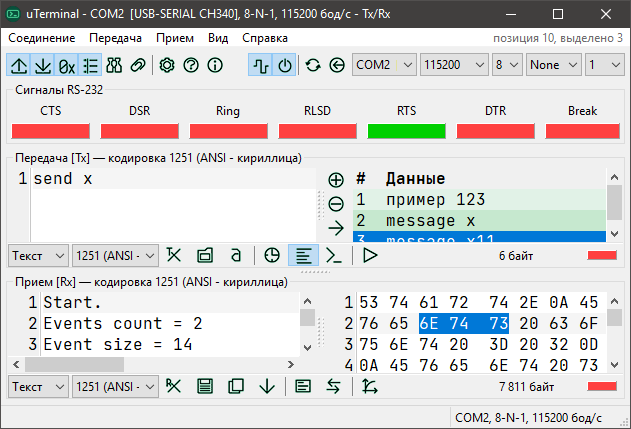
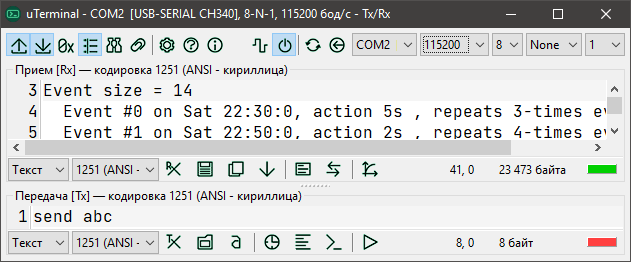

# uTerminal

## О приложении

uTerminal (читается `микротерминал`) — приложение-терминал для последовательного порта. Возможности:

- полная настройка параметров порта (скорость, биты данных, бит четности, стоп-биты),
- обновление списка портов и проверка доступности для подключения,
- автоматическое подключение к ранее использованному порту при запуске приложения,
- отключаемое аппаратное управление потоком (RTS/CTS),
- отключаемое отображение сигналов RS-232 с возможностью управления ими,
- отдельные буферы передачи и приема,
- отключаемое восстановление содержимого буферов при запуске приложения,
- выбор кодировки данных,
- отображение данных в разных форматах (текст, значения байтов — HEX, BIN, DEC),
- отдельные поля для отображения данных в HEX-виде,
- поиск и замена по данных,
- передача данных:
  - автоотправка по настраиваемому таймеру,
  - список сохраненных сообщений,
  - окно вставки символов (с кодами от 0 до 255),
  - загрузка данных из файла в буфер передачи,
  - настаиваемая длительность сигнала Break,
  - настаиваемый таймаут отправки,
- прием данных:
  - отключаемая прокрутка к концу при получении новых данных,
  - настраиваемые ответы на входные данные,
  - сохранение полученных данных в файл,
  - график (с настройкой формата данных),
  - отключение приемника без отключения от порта,
  - настраиваемая временная метка в начале пакета,
  - настаиваемый таймаут пакета,
  - настаиваемый размер буфера,
- продвинутые настройки интерфейса:
  - выбор языка интерфейса,
  - размещение полей данных,
  - отключение меню, строки статуса, индикаторов активности, счетчиков размера данных,
  - настройка шрифта полей данных, типа перехода на новую строку, ширины табуляции, видимости правой границы, отключение сглаживания,
  - отображение позиции курсора и размера выделения в полях данных (в байтах).

## Установка

Приложение не нуждается в установке (portable), работает из любого каталога. Скачать можно [отсюда](https://gitlab.com/riva-lab/uTerminal/-/releases).

## Как пользоваться

Руководство пользователя на русском — [help/uTerminal-help.md](help/uTerminal-help.md).

## Ответственность

Приложение предоставляется для свободного использования, без каких-либо гарантий и технической поддержки. Вы используете приложение по своему усмотрению и несете свою собственную ответственность за результаты его работы.

## Авторство

Copyright 2017-2018, 2021, 2022 Riva, [FreeBSD License, modified](license.md). История версий — [versions.md](versions.md).

Разработано в [Free Pascal RAD IDE Lazarus](http://www.lazarus-ide.org) v1.6.4 r54278, компилятор [Free Pascal Compiler](https://freepascal.org) v3.0.2 x86_64-win64-win32/win64.

Сторонние компоненты:

- [Ararat Synapse Library](http://synapse.ararat.cz) Release 40 2012-04-23. Copyright (c)2001-2011, Lukas Gebauer.
- [TAChart](http://wiki.lazarus.freepascal.org/TAChart) — a charting LGPL component for Lazarus. Copyright (C) 2006-2007 by Luis Rodrigues. Copyright (C) 2005-2006 by Philippe Martinole. Copyright (C) Alexander S. Klenin.

