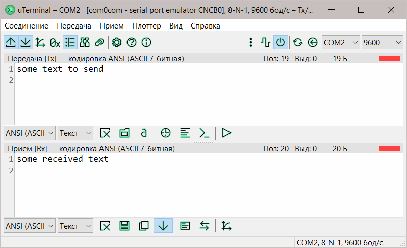
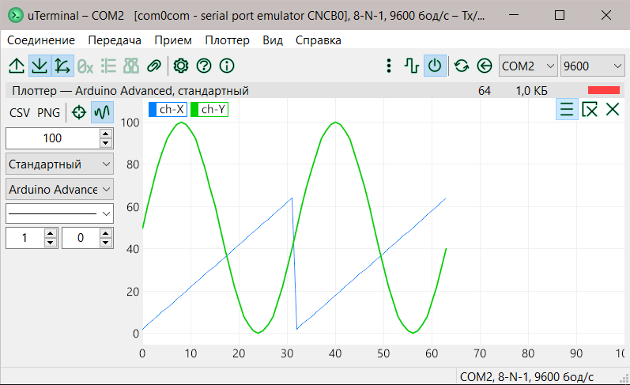

uTerminal
=========

## О приложении

**uTerminal** (читается `микротерминал`) — продвинутый терминал и плоттер для последовательного порта.

Возможности:

- порт:
  - полная настройка параметров порта (скорость, биты данных, бит четности, стоп-биты),
  - обновление списка портов и проверка доступности для подключения,
  - автоматическое подключение к ранее использованному порту при запуске приложения,
  - аппаратное управление потоком (RTS/CTS),
  - отображение сигналов RS-232 с возможностью управления ими,
- передача и прием:
  - отдельные буферы передачи и приема,
  - восстановление содержимого буферов при запуске приложения,
  - поддержка разных кодировок данных,
  - отображение данных в разных форматах (текст или байты в HEX, BIN, DEC),
  - отдельные поля для отображения данных в HEX-виде,
  - настройка перехода на новую строку,
  - поиск и замена по данных, с поддержкой регулярных выражений,
- передача данных:
  - автоматическая отправка по настраиваемому таймеру,
  - список сохраненных сообщений,
  - окно вставки символов (с кодами от 0 до 255),
  - загрузка данных из файла в буфер передачи,
  - настройка длительности сигнала Break,
  - настройка таймаута отправки,
- прием данных:
  - прокрутка к концу при получении новых данных,
  - поддержка ответа на входные данные,
  - сохранение полученных данных в файл,
  - приостановка приема без отключения от порта,
  - добавление временной метки в начале пакета,
  - настройка таймаута пакета,
  - настройка размера буфера,
- плоттер по принятых данных:
  - поддержка формата Arduino с расширенными возможностями,
  - поддержка формата RegExp Universal — заданный пользователем на основе регулярных выражений,
  - поддержка форматов "сырых" данных,
  - поддержка управляющих команд (очистка, сброс и т. д.),
  - до 16 линий, каждой из которых можно задать свой цвет, стиль, толщину, размер точек,
  - 3 основных режима отображения: стандартный, 2D и развертка,
  - 2 режима вывода: live и накопление данных,
  - экспорт данных в CSV,
  - экспорт изображения в PNG,
  - гибкая настройка отображения линий: цвет, стиль, толщина, точки,
  - трекер точек на линиях,
- интерфейс:
  - интуитивный и дружественный дизайн,
  - полная поддержка дисплеев разной плотности,
  - поддержка локализаций,
  - поддержка тем: светлая и темная,
  - изменяемое размещение полей Tx и Rx,
  - гибкость — многие элементы можно скрыть или изменить внешний вид,
- а также:
  - подробная справка,
  - поддержка онлайн-обновления.

## Компиляция

Особенности компиляции (со временем могут стать неактуальными):

1. FPC имеет модуль RegExpr, который поставляется с компилятором. Однако обычно он редко обновляется. Обновите его вручную: скопируйте с заменой файлы из `.\libraries\TRegExpr\src\` в `<LAZARUS_DIR>\fpc\<VERSION>\source\packages\regexpr\src\`. Этот модуль используется также в компоненте TSynEdit, поэтому необходимо обновить скомпилированные объектные файлы. Для этого сделайте следующее:
   - Откройте в IDE проект `testregexpr.lpi` из каталога `<LAZARUS_DIR>\fpc\<VERSION>\source\packages\regexpr\tests\` и скомпилируйте его для всех требуемых целевых платформ, например, для `x86_64-win64` и `i386-win32`. Если сразу не компилируется, закомментируйте строки, на которые указал компилятор, и повторите компиляцию.
   - Перейдите в каталог `<LAZARUS_DIR>\fpc\<VERSION>\source\packages\regexpr\tests\lib\`.
   - Скопируйте с заменой файлы из подкаталогов `<TARGET>` в соответствующие каталоги `<LAZARUS_DIR>\fpc\<VERSION>\units\<TARGET>\regexpr`.

## Установка

Приложение не нуждается в установке (portable), работает из любого каталога. Скачать можно [отсюда](https://gitlab.com/riva-lab/uTerminal/-/releases).

## Как пользоваться

Руководство пользователя на русском — [help/uTerminal-help.md](help/uTerminal-help.md).

## Ответственность

Приложение предоставляется для свободного использования, без каких-либо гарантий и технической поддержки. Вы используете приложение по своему усмотрению и несете свою собственную ответственность за результаты его работы.

## Авторство

Copyright (c) 2017-2018, 2021-2023 Riva, [FreeBSD License, modified](license.md). История версий — [versions.md](versions.md).

Разработано в [Free Pascal RAD IDE Lazarus](http://www.lazarus-ide.org) v2.2.6, компилятор [Free Pascal Compiler](https://freepascal.org) v3.2.2.

## Зависимости

- [Ararat Synapse Library](https://github.com/ultibohub/AraratSynapse) Ararat Synapse Library Release 40.1 (Ultibo port of Synapse) 2017-09-29 — the synchronyous socket library. Copyright (c)2001-2011, Lukas Gebauer.
- [TRegExpr](https://github.com/andgineer/TRegExpr) — regular expressions engine in pure Object Pascal. Copyright (c) 1999-2004 Andrey V. Sorokin.
- [TAChart](http://wiki.lazarus.freepascal.org/TAChart) — a charting LGPL component for Lazarus. Copyright (C) 2006-2007 by Luis Rodrigues. Copyright (C) 2005-2006 by Philippe Martinole. Copyright (C) Alexander S. Klenin.
- [metadarkstyle](https://github.com/zamtmn/metadarkstyle) — package that adds dark theme to your program under windows 10. Copyright (c) 2023 zamtmn.
- [BGRABitmap](https://bgrabitmap.github.io/) — a package designed to modify and create images with transparency.
- [BGRA Controls](https://bgrabitmap.github.io/bgracontrols/) — a set of graphical UI elements. Author: Lainz.
- [ImageSVGListDsgn](https://gitlab.com/riva-lab/ImageSVGListDsgn) — a list of SVG images instead of regular bitmaps. Copyright (c) 2023 Riva.
- [OnlineUpdater](https://gitlab.com/riva-lab/OnlineUpdater) — package for updating application from online repository. Copyright (c) 2023 Riva.
- [OpenSSL](https://www.openssl.org/): [License](bin/openssl-license.txt) — toolkit for general-purpose cryptography and secure communication. Copyright (c) 1998-2023 The OpenSSL Project Authors. Copyright (c) 1995-1998 Eric A. Young, Tim J. Hudson.
