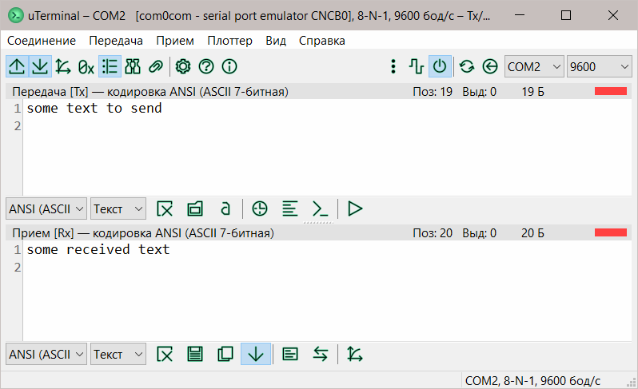
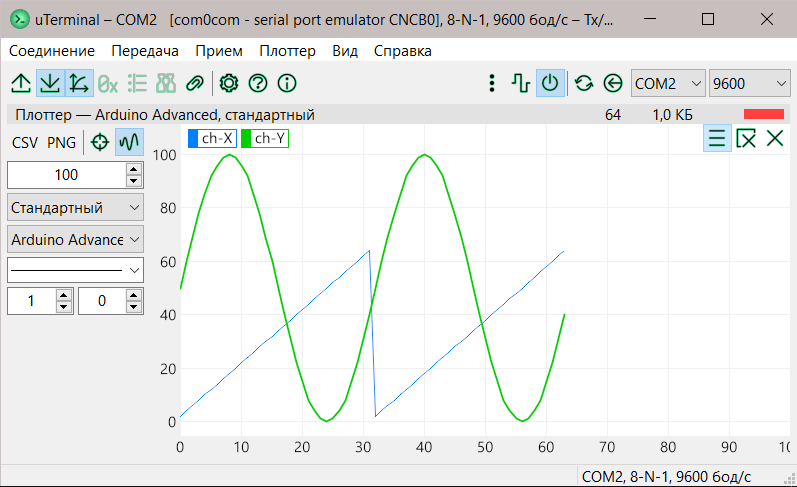

uTerminal
=========

MD/REPO: [**English**](readme.md) | [Русский](readme.ru.md)

HTML: [**English**](readme.html) | [Русский](readme.ru.html)

---

## About

**uTerminal** (pronounced `microterminal`) is an advanced terminal and plotter for serial port.

Features:

- port:
  
  - full configuration of port parameters (baudrate, data bits, parity bit, stop bits),
  - updating ports list and checking for connection availability,
  - automatic connection to last used port on application startup,
  - hardware flow control (RTS/CTS),
  - display and control of RS-232 signals,

- transmission and receprion:
  
  - separate transmit and receive buffers,
  - buffer data restoring on application startup,
  - support for various data encodings,
  - data display in different formats (text or bytes in HEX, BIN, DEC),
  - additional fields for viewing data in HEX,
  - line break setting,
  - search and replace data, regular expressions support,

- data transmission:
  
  - automatic sending by adjustable timer,
  - list of saved sequences,
  - character insertion (codes 0–255),
  - load data from file into buffer,
  - configurable Break signal duration,
  - configurable send timeout,

- data reception:
  
  - auto-scroll to the end upon receiving new data,
  - support for responding to incoming data,
  - save received data to file,
  - suspend reception without disconnecting from the port,
  - add timestamps to the beginning of packets,
  - configurable packet timeout,
  - configurable buffer size,

- plotter for received data:
  
  - support for Arduino format with advanced features,
  - support for RegExp Universal format, which is user defined format based on regular expressions,
  - support for "raw" data formats,
  - support for control commands (clear, reset etc.),
  - up to 16 lines, each customizable with its own color, style, thickness, and point size,
  - 3 display modes: standard, 2D and sweep,
  - 2 output modes: live and data accumulation,
  - data export to CSV,
  - image export to PNG,
  - flexible line display settings: color, style, thickness, point size,
  - point tracker on lines,

- interface:
  
  - intuitive and user-friendly design,
  - full support for displays with varying pixel densities (DPI),
  - localization support,
  - themes support: light and dark,
  - adjustable Tx and Rx panels layout,
  - flexibility, many items can be hidden or have their appearance modified,

- and also:
  
  - detailed help,
  - support for online updates.

## Compilation

Compilation notes (may become outdated over time):

1. FPC includes the **RegExpr** module, which is shipped with the compiler. However, it is rarely updated. Update it manually: copy files from `.\libraries\TRegExpr\src\` to `<LAZARUS_DIR>\fpc\<VERSION>\source\packages\regexpr\src\`, replacing existing files. This module is also used in the **TSynEdit** component, so compiled object files must be updated. To do this:
   - Open the project `testregexpr.lpi` located in `<LAZARUS_DIR>\fpc\<VERSION>\source\packages\regexpr\tests\` in the IDE and compile it for all required target platforms (e.g., ***x86_64-win64*** and ***i386-win32***). If it fails to compile immediately, comment out the lines indicated by the compiler and retry.
   - Navigate to the directory `<LAZARUS_DIR>\fpc\<VERSION>\source\packages\regexpr\tests\lib\`.
   - Copy files from the `<TARGET>` subdirectories to the corresponding directories in `<LAZARUS_DIR>\fpc\<VERSION>\units\<TARGET>\regexpr`, replacing existing files.

## Localization

Want to see the **uTerminal** interface in your native language? Start translating by choosing one of the following options:

1. Translate Gettext files directly from the repository, following the [instructions](help/uTerminal-help.md#%D0%BF%D0%BE%D0%BC%D0%BE%D1%89%D1%8C-%D0%B2-%D0%BB%D0%BE%D0%BA%D0%B0%D0%BB%D0%B8%D0%B7%D0%B0%D1%86%D0%B8%D0%B8-%D0%B8%D0%BD%D1%82%D0%B5%D1%80%D1%84%D0%B5%D0%B9%D1%81%D0%B0) in the help documentation.

Translations will be included in the next release if they cover at least 2/3 (~67%) of the text.

## Installation

**uTerminal** can be installed as a standard application. A portable version is also available, which requires no installation and runs from any directory. Installer and portable files are available in the [Releases](https://gitlab.com/riva-lab/uTerminal/-/releases) section, where you can obtain the latest version.

Other options (version may not be the latest):

- [Softpedia](https://www.softpedia.com/get/Network-Tools/Misc-Networking-Tools/uTerminal.shtml).

## How to Use

The user manual in Russian is available at [help/uTerminal-help.md](/help/uTerminal-help.md).

## Internet and Updates

**uTerminal** uses internet access exclusively for checking for updates. Updates are requested only from the **gitlab.com** server. The application does not require network access for normal operation. If the network is unavailable, **uTerminal** simply cannot check for updates.

> **Note.**
> 
> If **uTerminal** was installed for all users (of course, using administrator privileges), it cannot be updated during a standard user launch due to lack of permission to modify files. In such cases, when **uTerminal** offers an update, close it, restart it as an administrator, and perform the update.

## Liability

The application is provided for free use, without any warranties or technical support. You use the application at your own discretion and bear full responsibility for the results of its operation.

## Authorship

Copyright (c) 2017-2026 Riva, [FreeBSD License, modified](license.md). Changelog is available at [versions.md](versions.md).

Developed using [Free Pascal RAD IDE Lazarus](https://www.lazarus-ide.org) v4.4, [Free Pascal Compiler](https://freepascal.org) v3.2.2.

The Windows installer was created using [Inno Setup](https://jrsoftware.org/isinfo.php). [Copyright](https://jrsoftware.org/files/is/license.txt) (C) 1997-2023, Jordan Russell, Martijn Laan.

Installer icon: [icon-icons.com](https://icon-icons.com/icon/software/76005), [CC BY 4.0](https://creativecommons.org/licenses/by/4.0).

## Dependencies

- [Ararat Synapse Library](https://github.com/ultibohub/AraratSynapse) Ararat Synapse Library Release 40.1 (Ultibo port of Synapse) 2017-09-29 — the synchronyous socket library. Copyright (c)2001-2011, Lukas Gebauer.
- [TRegExpr](https://github.com/andgineer/TRegExpr) — regular expressions engine in pure Object Pascal. Copyright (c) 1999-2004 Andrey V. Sorokin.
- [TAChart](http://wiki.lazarus.freepascal.org/TAChart) — a charting LGPL component for Lazarus. Copyright (C) 2006-2007 by Luis Rodrigues. Copyright (C) 2005-2006 by Philippe Martinole. Copyright (C) Alexander S. Klenin.
- [metadarkstyle](https://github.com/zamtmn/metadarkstyle) — package that adds dark theme to your program under windows 10. Copyright (c) 2023 zamtmn.
- [BGRABitmap](https://bgrabitmap.github.io/) — a package designed to modify and create images with transparency.
- [BGRA Controls](https://bgrabitmap.github.io/bgracontrols/) — a set of graphical UI elements. Author: Lainz.
- [**ImageSVGListDsgn**](https://gitlab.com/riva-lab/ImageSVGListDsgn) — a list of SVG images instead of regular bitmaps. Copyright (c) 2023 Riva.
- [**OnlineUpdaterPkg**](https://gitlab.com/riva-lab/OnlineUpdaterPkg) — package for updating application from online repository. Copyright (c) 2023 Riva.
- [**AppFeaturesPkg**](https://gitlab.com/riva-lab/AppFeaturesPkg) — package for customizing GUI applications and implementing standard application functionality. Copyright (c) 2024-2025 Riva.
- [OpenSSL](https://www.openssl.org/): [License](bin/openssl-license.txt) — toolkit for general-purpose cryptography and secure communication. Copyright (c) 1998-2023 The OpenSSL Project Authors. Copyright (c) 1995-1998 Eric A. Young, Tim J. Hudson.
